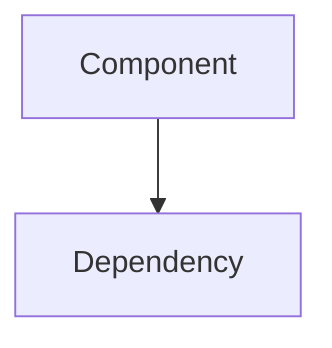

# Wiki データモデルとコンテンツ構造

## Wiki メタデータ

RSC レスポンス内の React コンポーネントプロパティに含まれる:

```json
{
  "metadata": {
    "repo_name": "microsoft/vscode",
    "commit_hash": "ca3b9bfb",
    "generated_at": "2026-04-16T05:58:02.235259",
    "config": null,
    "config_source": "none"
  }
}
```

| フィールド | 型 | 説明 |
|-----------|-----|------|
| `repo_name` | string | `org/repo` 形式のリポジトリ名 |
| `commit_hash` | string | ウィキ生成時の短いコミットハッシュ |
| `generated_at` | string | ISO 8601 形式の生成日時 |
| `config` | null/object | カスタム設定 (未設定時は null) |
| `config_source` | string | 設定のソース (`"none"` / その他) |

## ページ構造

### pages 配列

```json
{
  "pages": [
    {
      "page_plan": {
        "id": "1",
        "title": "VS Code Codebase Overview"
      },
      "content": "$17"
    },
    {
      "page_plan": {
        "id": "1.1",
        "title": "Application Startup and Process Architecture"
      },
      "content": "$18"
    }
  ]
}
```

### ページID体系

階層的なナンバリングシステム:

```
1        VS Code Codebase Overview (トップレベル)
├── 1.1  Application Startup and Process Architecture
└── 1.2  Build System and CI/CD

2        Core Editor (Monaco)
├── 2.1  Text Model and View Model
├── 2.2  Editor Widget Configuration and Minimap
└── 2.3  Inline Completions and Editor Contributions

3        Extension System
├── 3.1  Extension Host Architecture and Protocol
├── 3.2  VS Code Extension API
└── 3.3  Extension Marketplace and Management

4        Workbench Shell
├── 4.1  Layout and Parts System
├── 4.2  Window Management and Titlebar
└── 4.3  Views, Tree Controls, and UI Primitives
```

### URL スラッグ変換

ページタイトルから URL スラッグへの変換規則:

```
タイトル: "VS Code Codebase Overview"
ID: "1"
スラッグ: "1-vs-code-codebase-overview"

変換ルール:
  1. ページID をプレフィックスに
  2. タイトルを小文字化
  3. スペースをハイフンに
  4. 特殊文字は括弧付きで保持: "(monaco)" → "(monaco)"
  5. カンマは除去
```

## Markdown コンテンツ構造

各ページの Markdown は以下の構造を持つ:

```markdown
# ページタイトル

<details>
<summary>Relevant source files</summary>

The following files were used as context for generating this wiki page:

- [path/to/file.ts](リンク)
- [path/to/another.ts](リンク)
- ...

</details>

テキスト導入部...

## セクション1

本文テキスト...



## セクション2

本文テキスト...

> **Note:** 補足情報

Sources: [file.ts:1-159](), [other.ts:10-50]()
```

### コンテンツ要素

| 要素 | 説明 |
|------|------|
| `# タイトル` | ページの H1 見出し (1つのみ) |
| `<details>` | 折りたたみ可能なソースファイル一覧 |
| `## セクション` | 主要セクション (H2) |
| `### サブセクション` | サブセクション (H3) |
| ` ```mermaid ``` ` | Mermaid 図 (graph TD, flowchart, sequence) |
| `> **Note:**` | 補足情報ブロック |
| `Sources: [...]()` | ページ末尾のソース引用 |

### Mermaid 図の種類

DeepWiki のウィキページには以下の Mermaid 図が含まれる:

```
graph TD      → トップダウンの依存関係図
flowchart TD  → トップダウンのフローチャート
flowchart LR  → 左から右のフローチャート
sequenceDiagram → シーケンス図
classDiagram   → クラス図
```

### ソース引用形式

ページ末尾に参照されたソースコードへのリンク:

```
Sources: [src/vs/editor/common/model.ts:1-159](), [src/vs/editor/common/viewModel.ts:10-50]()
```

形式: `[ファイルパス:開始行-終了行]()`

## コンポーネントプロパティ

RSC レスポンス内の React コンポーネントに渡されるプロパティ:

```json
{
  "repoName": "microsoft/vscode",
  "hasConfig": false,
  "canSteer": true,
  "wiki": { "metadata": {...}, "pages": [...] },
  "children": [...]
}
```

| プロパティ | 型 | 説明 |
|-----------|-----|------|
| `repoName` | string | `org/repo` 形式 |
| `hasConfig` | boolean | カスタム設定の有無 |
| `canSteer` | boolean | ウィキのカスタマイズ可否 |
| `wiki` | object | ウィキ全体のデータ |
| `children` | array | 子コンポーネント |

## データフロー

```
サーバー側 (Next.js)
    │
    ├── リポジトリ情報からウィキデータを取得/生成
    │   ├── metadata: リポジトリ情報 + 生成日時
    │   └── pages[]: 全ページの Markdown コンテンツ
    │
    ├── RSC シリアライゼーション
    │   ├── 各ページの Markdown → T-type チャンク
    │   ├── メタデータ + ページ配列 → React プロパティ
    │   └── コンポーネント import → I-type
    │
    └── text/x-component として配信

クライアント側 (React)
    │
    ├── RSC ストリームをパース
    ├── T-type チャンクから Markdown を復元
    ├── wiki.pages[].content の "$<id>" 参照を解決
    ├── Markdown → React コンポーネントにレンダリング
    └── Mermaid 図を SVG に変換
```
