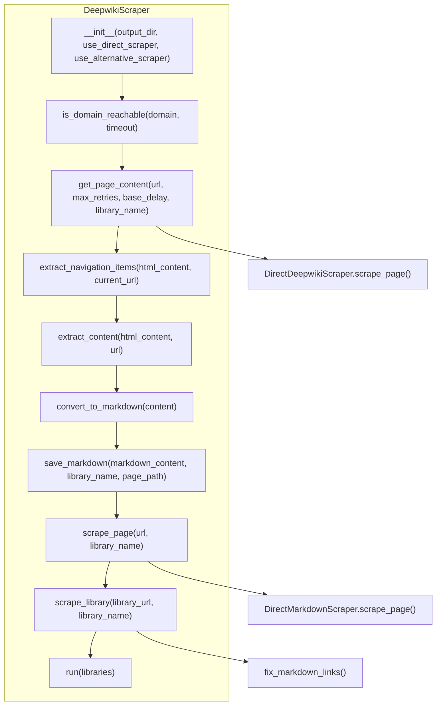
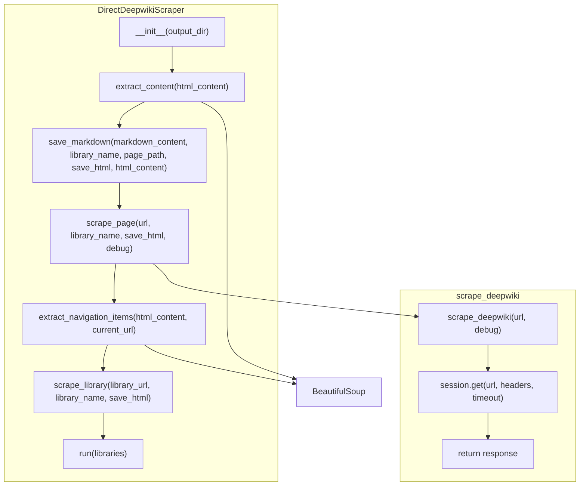
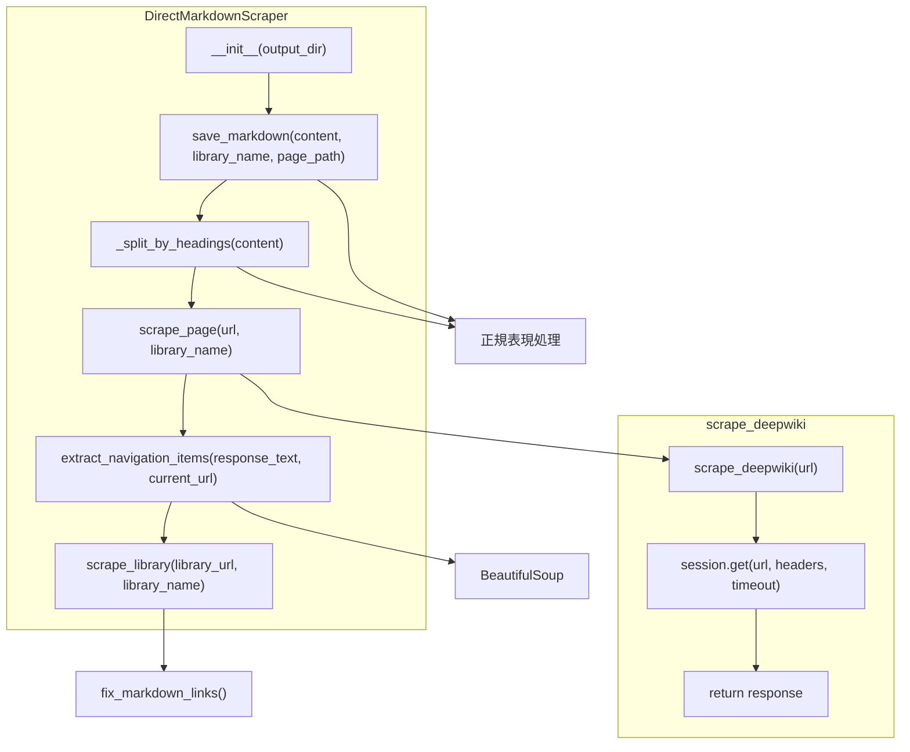
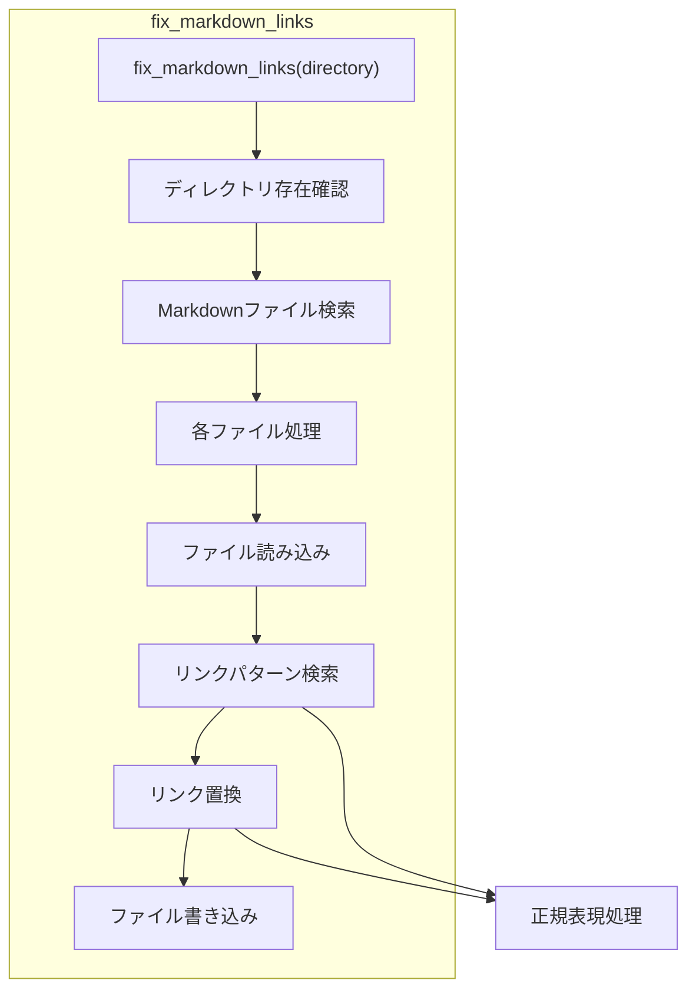
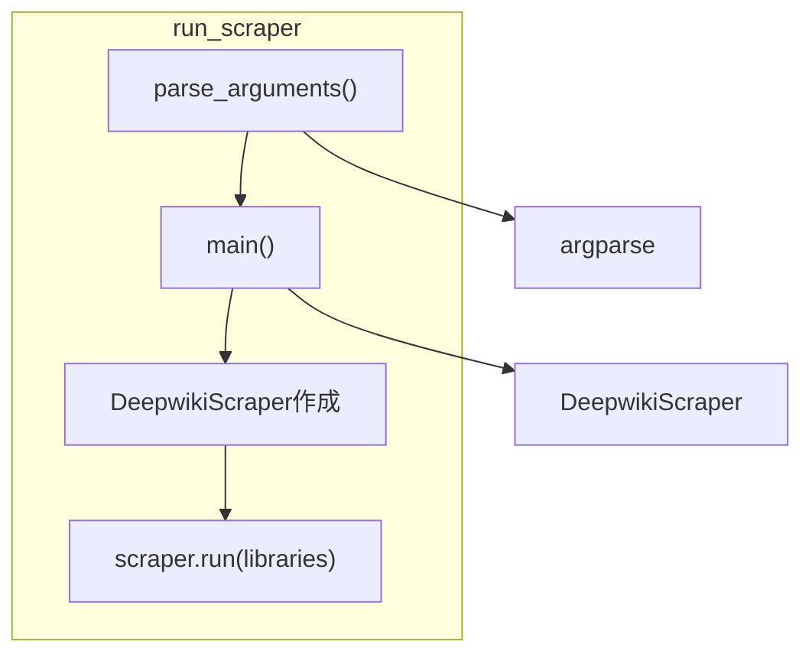
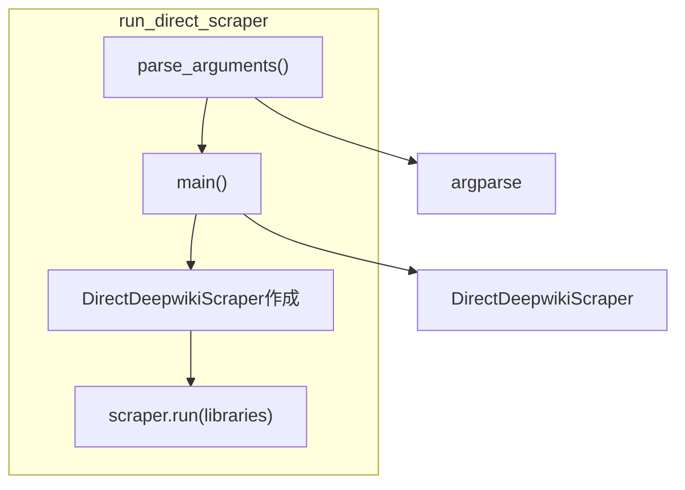
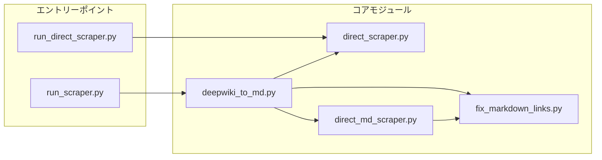
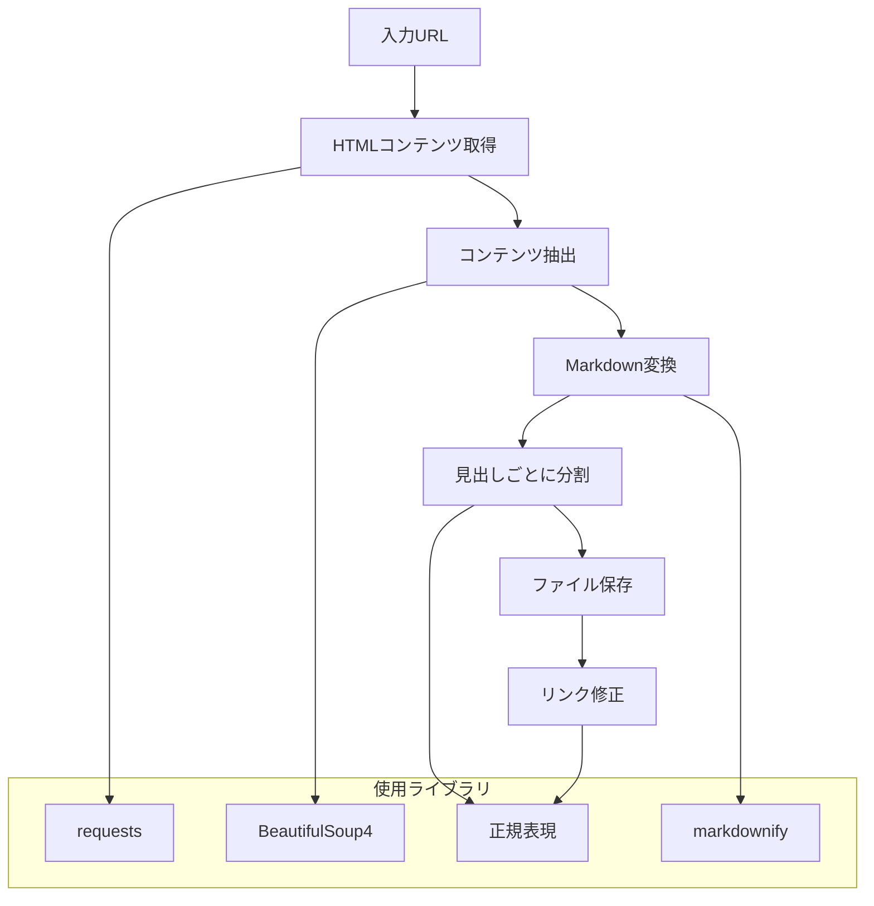

# deepwiki_to_md 個別ファイル詳細図

このドキュメントでは、deepwiki_to_md プロジェクトの各ファイルの詳細な関数とクラスの関係を Mermaid 図を使って視覚化しています。

## deepwiki_to_md.py の詳細構造

## direct_scraper.py の詳細構造

## direct_md_scraper.py の詳細構造

## fix_markdown_links.py の詳細構造

## run_scraper.py の詳細構造

## run_direct_scraper.py の詳細構造

## コンポーネント間の依存関係

## データ処理フロー

