# Overview

<details>
<summary>Relevant source files</summary>

The following files were used as context for generating this wiki page:

- [README.md](README.md)
- [deepwiki_to_md/deepwiki_to_md.py](deepwiki_to_md/deepwiki_to_md.py)

</details>


This document provides an introduction to the `deepwiki_to_md` repository, a Python-based tool designed to scrape content from Deepwiki websites and convert it to Markdown format.

## Purpose and Scope

The `deepwiki_to_md` tool serves as a specialized content extraction and conversion utility for Deepwiki-based documentation sites. Its primary capabilities include:

- Scraping content from Deepwiki sites using multiple strategies
- Converting HTML content to Markdown format using the `markdownify` library
- Saving converted files in an organized directory structure
- Supporting multiple scraping strategies with graceful fallback mechanisms
- Processing multiple documentation libraries in a single run
- Fixing Markdown links in the generated content
- Converting Markdown files to YAML format (for use with LLMs)
- Scraping responses from chat interfaces using Selenium

For detailed information about the core architecture and components, see [Core Architecture](#2). For usage instructions, refer to the [Usage Guide](#4).

## System Architecture Overview

### High-Level System Components

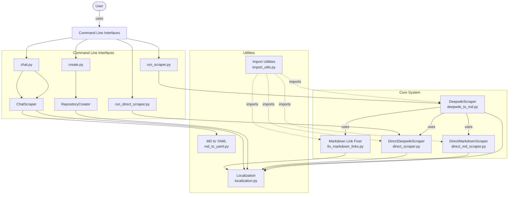

Sources: deepwiki_to_md/deepwiki_to_md.py, README.md

This diagram illustrates the high-level components of the system and their relationships. The `DeepwikiScraper` class serves as the central component that can utilize various specialized scrapers depending on configuration parameters.

### Scraping Strategy Hierarchy

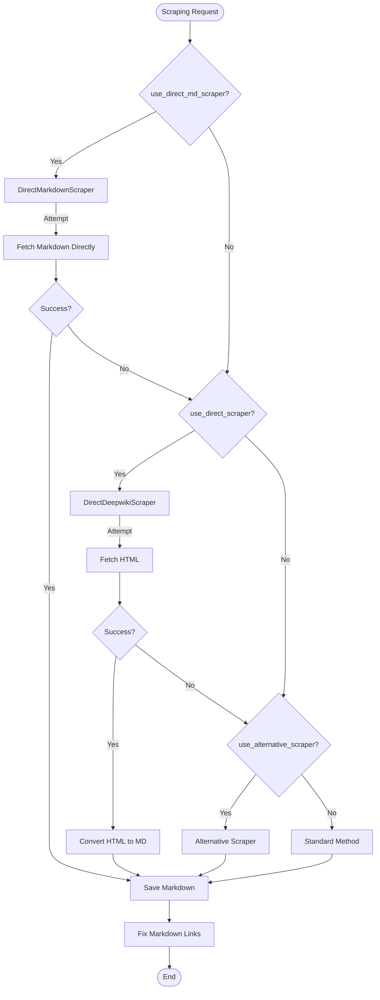

Sources: deepwiki_to_md/deepwiki_to_md.py:499-621, README.md

This flowchart shows how the system prioritizes different scraping strategies based on configuration and success/failure of each method. The tool implements a robust fallback mechanism, starting with the highest priority method (DirectMarkdownScraper if enabled), and falling back to alternative methods if earlier methods fail.

### Data Flow Through the System

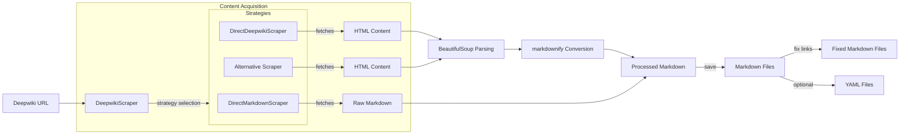

Sources: deepwiki_to_md/deepwiki_to_md.py:162-225, deepwiki_to_md/deepwiki_to_md.py:338-379, README.md

This diagram depicts the general data flow through the system, from URL input to saved Markdown files. The content can be acquired through different strategies, processed in various ways, and finally saved to the file system.

## Configuration Options

The tool offers several configuration options that control its behavior:

| Parameter | Description | Default |
|-----------|-------------|---------|
| `output_dir` | Output directory for Markdown files | "Documents" |
| `use_direct_scraper` | Use DirectDeepwikiScraper for scraping | True |
| `use_alternative_scraper` | Use alternative scraper for pages without navigation items | True |
| `use_direct_md_scraper` | Use DirectMarkdownScraper to fetch Markdown directly | False |

Sources: README.md

## Output Structure

Converted Markdown files are saved in an organized directory structure:

```
Documents/
├── library_name1/
│   └── md/
│       ├── page1.md
│       ├── page2.md
│       └── ...
├── library_name2/
│   └── md/
│       ├── page1.md
│       ├── page2.md
│       └── ...
└── ...
```

Sources: README.md

## Key Features

### Multiple Scraping Methods

1. **DirectMarkdownScraper**: Retrieves Markdown content directly
   - Most reliable output quality
   - Bypasses HTML conversion process entirely
   - Available via `use_direct_md_scraper=True` parameter

2. **DirectDeepwikiScraper**: Direct HTML content retrieval
   - Uses specialized headers for reliable content extraction
   - Preserves HTML structure needed for navigation
   - Available via `use_direct_scraper=True` parameter

3. **Standard Scraping**: Fallback method
   - Extracts navigation items from HTML structure
   - Converts content using HTML-to-Markdown conversion
   - Used automatically when other methods fail

Sources: README.md

### Robust Error Handling

The system implements comprehensive error handling mechanisms:

- Domain validation before scraping attempts
- Connectivity checks before attempting content retrieval
- Clear error messages for troubleshooting
- Graceful fallback between scraping methods
- Retry mechanisms with exponential backoff for transient errors

Sources: README.md

## License

The `deepwiki_to_md` tool is released under the MIT License.

Sources: LICENSE

# Core Architecture

<details>
<summary>Relevant source files</summary>

The following files were used as context for generating this wiki page:

- [README.md](README.md)
- [deepwiki_to_md/deepwiki_to_md.py](deepwiki_to_md/deepwiki_to_md.py)
- [deepwiki_to_md/deepwiki_to_md_root.py](deepwiki_to_md/deepwiki_to_md_root.py)

</details>


This document describes the core architecture of the DeepWiki to Markdown converter system. It explains the main components, their interactions, and how the system orchestrates the conversion process from DeepWiki content to Markdown format. The system employs a flexible strategy-based approach that prioritizes different scraping methods based on configuration and fallback mechanisms. For information about specific scraping strategies, see [Scraping Strategy Prioritization](#2.1).

## DeepwikiScraper Class Overview

The `DeepwikiScraper` class serves as the central orchestrator of the conversion process. It coordinates different scraping strategies, content processing, and file management to effectively scrape DeepWiki content and convert it to Markdown format.

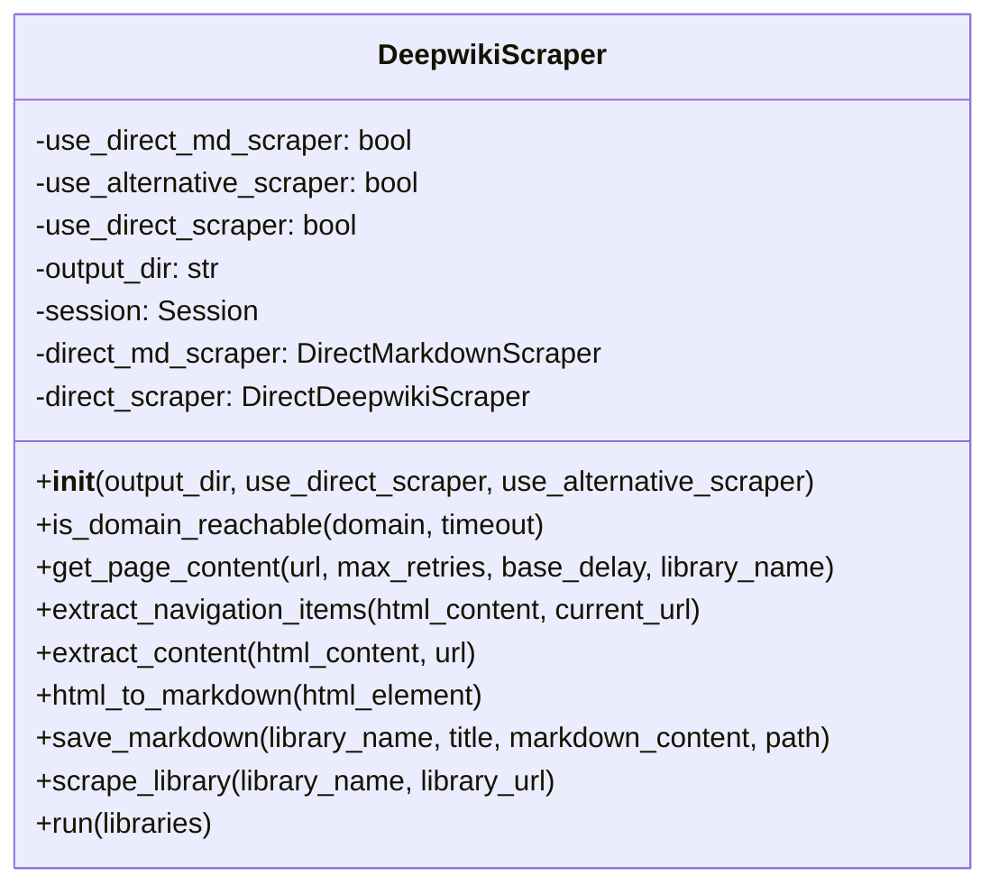

Sources: [deepwiki_to_md/deepwiki_to_md.py:91-650]()

## Initialization and Configuration

The `DeepwikiScraper` class is initialized with several parameters that control its behavior:

```python
def __init__(self, output_dir="Documents", use_direct_scraper=False, use_alternative_scraper=False):
```

Although the method signature includes only these parameters, the class internally manages an additional `use_direct_md_scraper` flag that is set to `True` by default when neither `use_direct_scraper` nor `use_alternative_scraper` is enabled. These parameters determine:

- Where to save generated Markdown files (`output_dir`)
- Which scraping strategies to use, with a clear prioritization order:
  1. DirectMarkdownScraper (default)
  2. Alternative scraper (scrape_deepwiki function)
  3. DirectDeepwikiScraper
  4. Standard static scraping

Sources: [deepwiki_to_md/deepwiki_to_md.py:92-114]()

## Main Components and Their Interactions

The system consists of several key components that work together to perform the conversion from DeepWiki to Markdown.

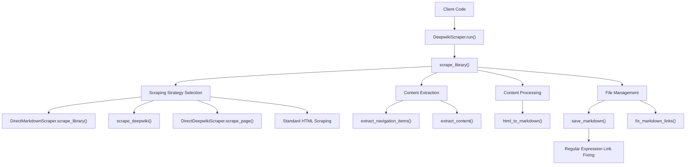

Sources: [deepwiki_to_md/deepwiki_to_md.py:450-621](), [deepwiki_to_md/deepwiki_to_md.py:381-448]()

## Workflow Process

The core workflow of the system begins with the `run()` method and flows through a series of steps to scrape content and convert it to Markdown.

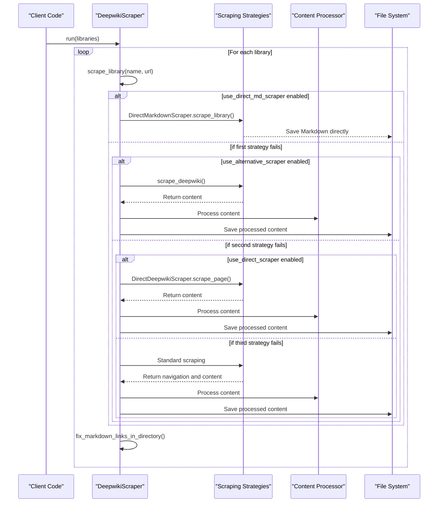

Sources: [deepwiki_to_md/deepwiki_to_md.py:540-550]()

## Content Extraction and Processing

The system employs a robust approach to extract relevant content from DeepWiki pages and convert it to Markdown format.

### Navigation Extraction

The `extract_navigation_items()` method parses HTML content to identify navigation elements, extracting their titles and URLs for further processing.

Sources: [deepwiki_to_md/deepwiki_to_md.py:184-217]()

### Content Extraction

The `extract_content()` method identifies and extracts the main content from HTML pages using a cascading selector approach:

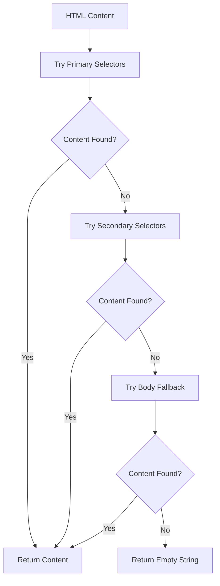

Sources: [deepwiki_to_md/deepwiki_to_md.py:219-277]()

### HTML to Markdown Conversion

The `html_to_markdown()` method converts HTML content to Markdown format using the `markdownify` library:

1. Removes navigation elements from the HTML
2. Converts the cleaned HTML to Markdown
3. Returns properly formatted Markdown content

Sources: [deepwiki_to_md/deepwiki_to_md.py:279-317]()

## File Management

The system organizes and manages files in a structured manner to maintain clear organization of the converted content.

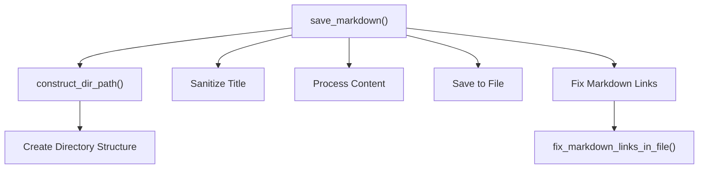

Sources: [deepwiki_to_md/deepwiki_to_md.py:319-380]()

### Directory Structure

The system creates a directory structure based on:
- Output directory (configurable)
- Library name
- Path from URL (when available)

The directory structure creation is handled in the `save_markdown` method:
```
If path is provided:
    dir_path = os.path.join(os.path.abspath(os.getcwd()), self.output_dir, path, "md")
Otherwise:
    dir_path = os.path.join(os.getcwd(), self.output_dir, library_name, "md")
```

This structure helps organize content from different libraries and maintain proper relationships between files.

### File Naming and Content Processing

The system:
1. Sanitizes titles to create valid filenames using regular expressions
2. Removes unnecessary content from the beginning of files (first 28 lines)
3. Saves content with proper UTF-8 encoding
4. Fixes internal links between Markdown files in two ways:
   - Immediately after saving, using regex to replace URLs with empty parentheses
   - After processing all files, using the imported `fix_markdown_links` function

Sources: [deepwiki_to_md/deepwiki_to_md.py:381-448](), [deepwiki_to_md/deepwiki_to_md.py:75-88]()

## Error Handling and Resilience

The system includes robust error handling to ensure that failures in one part of the process don't affect the entire operation:

- Domain reachability checks
- Request retries with exponential backoff
- Fallback mechanisms for content extraction
- Strategy prioritization with graceful degradation
- Exception handling without interrupting the scraping process

Sources: [deepwiki_to_md/deepwiki_to_md.py:89-178]()

## Configuration and Extension Points

The `DeepwikiScraper` class provides several configuration options that allow users to customize its behavior:

| Parameter | Default | Description |
|-----------|---------|-------------|
| `output_dir` | "Documents" | Base directory for saving Markdown files |
| `use_direct_scraper` | False | Whether to use `DirectDeepwikiScraper` |
| `use_alternative_scraper` | False | Whether to use `scrape_deepwiki` function from direct_scraper.py |

The system employs dynamic module importing to handle dependencies and provide fallback mechanisms when modules are not available. This ensures graceful degradation if certain components cannot be loaded.

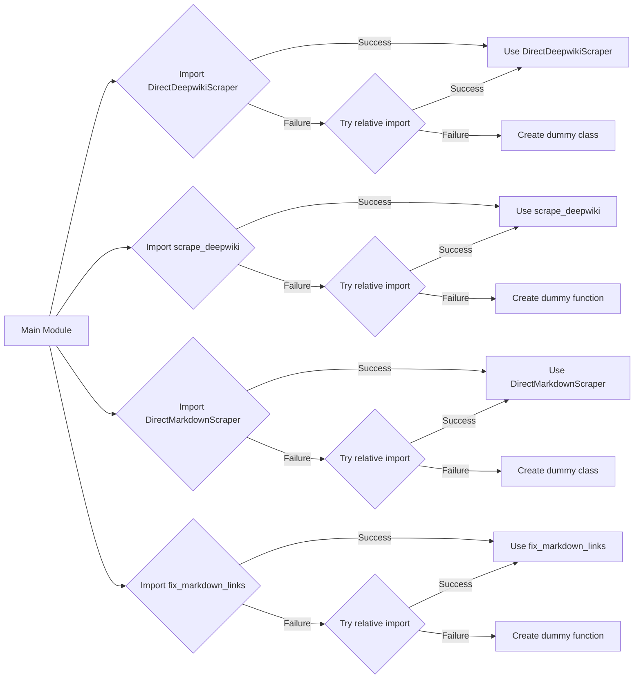

Sources: [deepwiki_to_md/deepwiki_to_md.py:15-88]()

## Core Method: scrape_library

The `scrape_library()` method represents the core functionality of the system, orchestrating the entire scraping and conversion process for a single library:

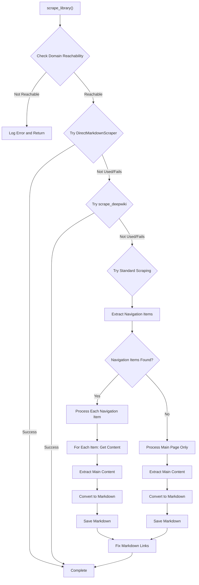

Sources: [deepwiki_to_md/deepwiki_to_md.py:381-520]()

This method demonstrates the complete workflow from URL validation to content extraction, processing, and saving, with appropriate fallback mechanisms at each step.

# Scraping Strategy Prioritization

<details>
<summary>Relevant source files</summary>

The following files were used as context for generating this wiki page:

- [README.md](README.md)
- [deepwiki_to_md/deepwiki_to_md.py](deepwiki_to_md/deepwiki_to_md.py)
- [deepwiki_to_md/lang/en_us.json](deepwiki_to_md/lang/en_us.json)

</details>


## Purpose and Scope

This document details the scraping strategy prioritization system within the DeepWiki to Markdown converter. It explains how the application prioritizes different scraping methods, implements fallback mechanisms when higher-priority strategies fail, and offers configuration options to customize the scraping behavior. For information about specific scrapers, see [DirectMarkdownScraper](#2.2) and [DirectDeepwikiScraper](#2.3).

Sources: [deepwiki_to_md/deepwiki_to_md.py:49-67]()`

## Strategy Priority Hierarchy

The DeepWiki to Markdown converter implements a hierarchical strategy prioritization system that attempts multiple scraping methods in a defined order. This architecture ensures robust content extraction even when certain methods fail with specific websites.

### Priority Order

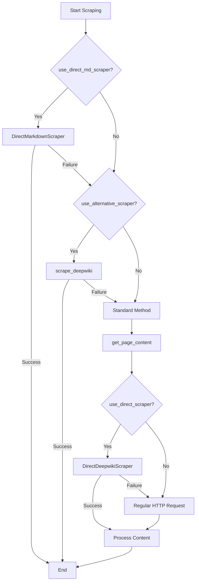

The scraping strategies are attempted in the following order:

1. **DirectMarkdownScraper** - Highest priority, attempts to directly extract Markdown content
2. **scrape_deepwiki** - Second priority, uses an alternative scraping approach via the function in direct_scraper.py
3. **Standard Method with DirectDeepwikiScraper** - Uses DirectDeepwikiScraper within get_page_content if enabled
4. **Standard Method with Regular HTTP** - Lowest priority, fallback method using static HTTP requests

Sources: [deepwiki_to_md/deepwiki_to_md.py:91-114](), [deepwiki_to_md/deepwiki_to_md.py:499-551](), [deepwiki_to_md/deepwiki_to_md.py:162-223]()

## Implementation Details

The prioritization system is implemented in the `DeepwikiScraper` class, which coordinates the scraping process and manages the fallback between different strategies.

### Initialization

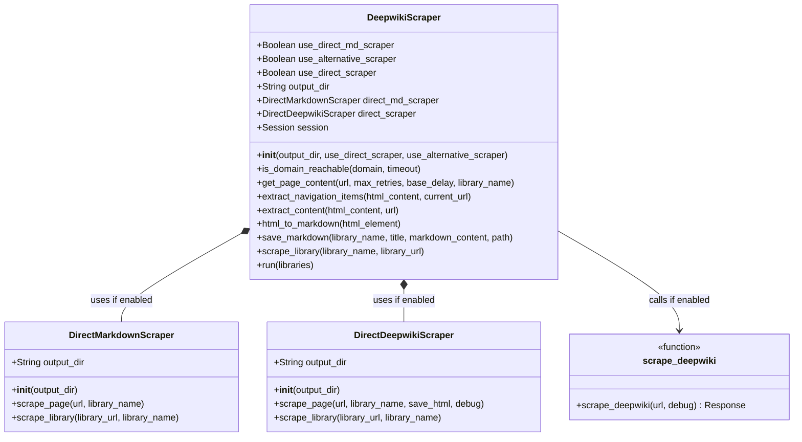

The prioritization flags are set during initialization of the `DeepwikiScraper` class. Although `use_direct_md_scraper` is not an explicit parameter of the constructor, it is set internally based on the other flags:

| Parameter | Type | Default | Description |
|-----------|------|---------|-------------|
| `output_dir` | String | "Documents" | Base directory for saving Markdown files |
| `use_direct_scraper` | Boolean | False | Whether to use DirectDeepwikiScraper |
| `use_alternative_scraper` | Boolean | False | Whether to use scrape_deepwiki function |

When neither `use_direct_scraper` nor `use_alternative_scraper` is enabled, `use_direct_md_scraper` is automatically set to `True`, making DirectMarkdownScraper the default strategy.

Sources: [deepwiki_to_md/deepwiki_to_md.py:91-133]()

## Fallback Mechanism

The system implements a fallback mechanism that gracefully degrades to lower-priority strategies when higher-priority ones fail. This is implemented in the `scrape_library` method.

### Fallback Flow

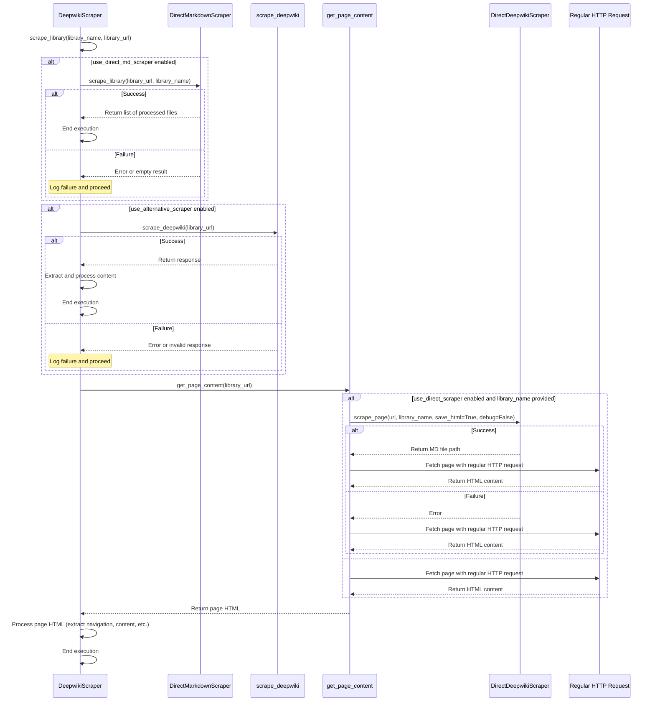

Key aspects of the fallback mechanism:
1. Each strategy attempt is wrapped in try-except blocks to catch failures
2. Detailed logging occurs at each step to document the fallback process
3. The system continues to the next strategy only if the previous one explicitly fails
4. DirectDeepwikiScraper is used within the get_page_content method when use_direct_scraper is enabled
5. Even when DirectDeepwikiScraper is successful, the regular HTTP request is still performed to ensure HTML content is available for further processing

Sources: [deepwiki_to_md/deepwiki_to_md.py:499-551](), [deepwiki_to_md/deepwiki_to_md.py:162-223]()

## Strategy-Specific Behavior

Each scraping strategy has unique characteristics that make it suited for different situations.

### DirectMarkdownScraper

The highest-priority scraper that attempts to directly obtain content in Markdown format without HTML-to-Markdown conversion.

**Implementation Path**: [deepwiki_to_md/direct_md_scraper.py:126-451]()

**Key Methods**:
- `scrape_page`: Extracts content from a single page
- `scrape_library`: Processes an entire library of pages
- `remove_custom_end_data`: Cleans up extracted Markdown content

### scrape_deepwiki Function

A standalone function that provides an alternative approach to extract content from DeepWiki pages.

**Implementation Path**: [deepwiki_to_md/direct_md_scraper.py:49-123](), [deepwiki_to_md/direct_scraper.py:18-93]()

**Key Features**:
- Configures specialized headers for DeepWiki sites
- Returns a raw response object for further processing

### DirectDeepwikiScraper

A scraper class that provides direct HTML extraction with specialized headers.

**Implementation Path**: [deepwiki_to_md/direct_scraper.py:96-429]()

**Key Methods**:
- `extract_content`: Extracts main content from HTML
- `scrape_page`: Processes a single page with optional debug output
- `scrape_library`: Handles an entire library of pages

### Standard Scraping Method

The fallback method that uses basic HTTP requests and BeautifulSoup parsing.

**Implementation Path**: [deepwiki_to_md/deepwiki_to_md.py:184-277]()

**Key Methods**:
- `extract_navigation_items`: Finds navigation links in the page
- `extract_content`: Identifies the main content section
- `html_to_markdown`: Converts HTML to Markdown

Sources: [deepwiki_to_md/deepwiki_to_md.py:184-277](), [deepwiki_to_md/direct_md_scraper.py:126-451](), [deepwiki_to_md/direct_scraper.py:96-429]()

## Scraping Process Flow

The following diagram illustrates the complete flow of the scraping process, including strategy selection and content processing:

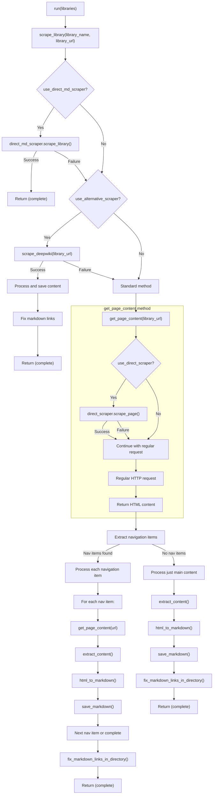

This flow demonstrates how the system prioritizes different strategies and handles various scenarios. The key points are:

1. DirectMarkdownScraper is tried first if enabled (default)
2. The alternative scraper (scrape_deepwiki) is tried next if enabled
3. The standard method is used as a fallback, which includes:
   - Using DirectDeepwikiScraper within get_page_content if enabled
   - Falling back to regular HTTP requests if needed
   - Processing navigation items or just the main content based on what's found

Sources: [deepwiki_to_md/deepwiki_to_md.py:450-621](), [deepwiki_to_md/deepwiki_to_md.py:162-223]()

## Configuration Examples

Below are examples of how to configure the `DeepwikiScraper` with different strategy prioritizations:

| Configuration | Description | Code Example |
|---------------|-------------|--------------|
| Default | Uses DirectMarkdownScraper by default | `scraper = DeepwikiScraper()` |
| DirectDeepwikiScraper | Uses DirectDeepwikiScraper | `scraper = DeepwikiScraper(use_direct_scraper=True)` |
| Alternative Scraper | Uses the alternative scraper | `scraper = DeepwikiScraper(use_alternative_scraper=True)` |
| Custom Output | Changes the output directory | `scraper = DeepwikiScraper(output_dir="MyDocuments")` |

The constructor logic ensures mutual exclusivity among scraping strategies:

```python
# If use_direct_scraper is True, other flags are set to False
if use_direct_scraper:
    self.use_direct_scraper = True
    self.use_alternative_scraper = False
    self.use_direct_md_scraper = False
# If use_alternative_scraper is True, other flags are set appropriately
elif use_alternative_scraper:
    self.use_direct_scraper = False
    self.use_alternative_scraper = True
    self.use_direct_md_scraper = False
# Default case: use DirectMarkdownScraper
else:
    self.use_direct_scraper = False
    self.use_alternative_scraper = False
    self.use_direct_md_scraper = True
```

This logic guarantees that only one scraping strategy is prioritized at a time, preventing conflicts.

Sources: [deepwiki_to_md/deepwiki_to_md.py:91-114](), [deepwiki_to_md/deepwiki_to_md.py:647-664]()

## Summary

The scraping strategy prioritization system is a core architectural feature of the DeepWiki to Markdown converter. By implementing a hierarchical approach with graceful fallback, the system maximizes the chances of successfully extracting content from DeepWiki pages. The ability to configure which strategies are enabled provides flexibility to adapt to different site structures and content formats.

# DirectMarkdownScraper

<details>
<summary>Relevant source files</summary>

The following files were used as context for generating this wiki page:

- [README.md](README.md)
- [deepwiki_to_md/deepwiki_to_md.py](deepwiki_to_md/deepwiki_to_md.py)
- [deepwiki_to_md/direct_md_scraper.py](deepwiki_to_md/direct_md_scraper.py)

</details>


The DirectMarkdownScraper is a specialized component in the deepwiki_to_md system designed to extract content directly in Markdown format from Deepwiki websites. Unlike other scraping approaches that extract HTML and then convert it to Markdown, this scraper is optimized for sites where content is already available in Markdown form, leading to more efficient extraction with higher fidelity.

As shown in the system architecture diagrams, this scraper has the highest priority in the scraping strategy hierarchy when enabled. For information about other scraping strategies, see [Scraping Strategy Prioritization](#2.1) and [DirectDeepwikiScraper](#2.3).

## Position in Scraping Strategy Hierarchy

The DirectMarkdownScraper serves as the primary scraping method when enabled, with the system falling back to alternative methods if it fails.

**DirectMarkdownScraper in the Scraping Hierarchy**
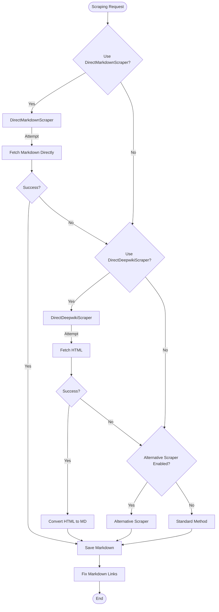

Sources:
- [deepwiki_to_md/deepwiki_to_md.py:92-125]() - Initialization and strategy selection
- [deepwiki_to_md/deepwiki_to_md.py:499-552]() - Scraping prioritization logic

## Core Workflow

The DirectMarkdownScraper follows a methodical process when extracting content from Deepwiki sites.

**DirectMarkdownScraper Scraping Sequence**
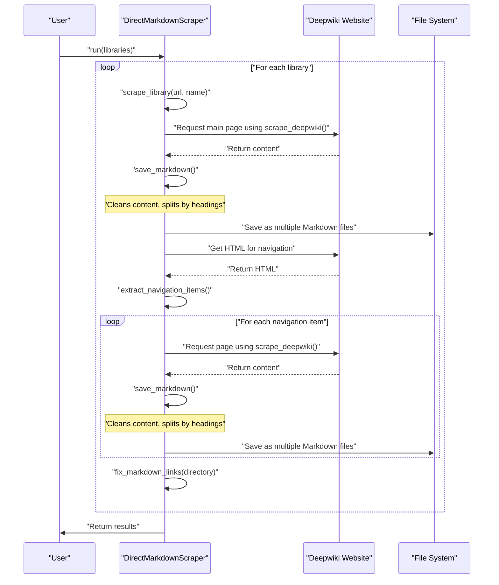

Sources:
- [deepwiki_to_md/direct_md_scraper.py:532-560]() - `run()` method
- [deepwiki_to_md/direct_md_scraper.py:421-530]() - `scrape_library()` method
- [deepwiki_to_md/direct_md_scraper.py:336-383]() - `scrape_page()` method
- [deepwiki_to_md/direct_md_scraper.py:127-281]() - `save_markdown()` method

## Class Structure

The `DirectMarkdownScraper` class provides a comprehensive set of methods that work together to scrape and process content.

**DirectMarkdownScraper Class Structure**
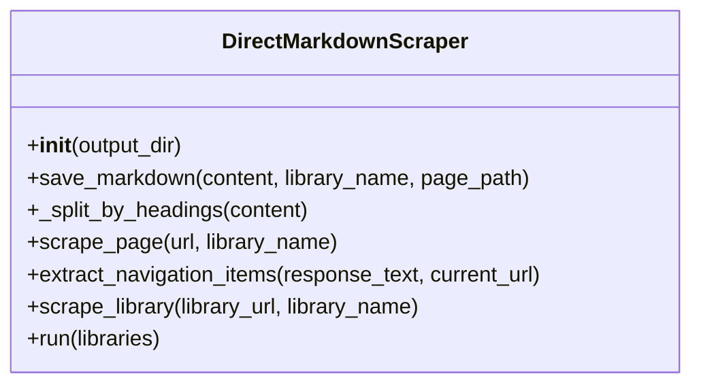

The class relies on the external `scrape_deepwiki()` function to handle the actual HTTP requests with properly configured headers.

Sources:
- [deepwiki_to_md/direct_md_scraper.py:114-560]() - Complete class definition
- [deepwiki_to_md/direct_md_scraper.py:36-112]() - The `scrape_deepwiki()` function

## Key Methods and Their Functions

### Initialization

The `__init__()` method initializes the scraper with an output directory parameter:

```python
def __init__(self, output_dir="DirectMarkdownDocuments"):
    self.output_dir = output_dir
```

This determines where the extracted Markdown files will be saved.

Sources:
- [deepwiki_to_md/direct_md_scraper.py:127-134]()

### Content Cleaning

Content cleaning is integrated into the `save_markdown()` method, which removes extraneous data typically found at the end of Deepwiki pages using predefined patterns:

```python
# From save_markdown() method
end_data_patterns = [
    r'^-\s+Continued improvements',  # Example: "- Continued improvements to developer experience..."
    r'^c:null$',                     # Example: "c:null"
    r'^\d+:\[\["',                   # Example: "10:[[\"$\",\"title\",\"0\",{\"children\":..."
]

for pattern in end_data_patterns:
    match = re.search(pattern, cleaned_content, re.MULTILINE)
    if match:
        # Keep only the content before the matched line
        end_pos = match.start()
        original_length = len(cleaned_content)
        cleaned_content = cleaned_content[:end_pos].rstrip()
```

This ensures the final Markdown only contains the actual documentation content without metadata or system-specific information.

Sources:
- [deepwiki_to_md/direct_md_scraper.py:194-209]() - Content cleaning in save_markdown

### Page Scraping

The `scrape_page()` method handles extraction of a single page from a Deepwiki site:

1. Parses the URL to ensure correct formatting
2. Calls the `scrape_deepwiki()` function to retrieve content directly as Markdown
3. Extracts the page path from the URL for use in file naming
4. Saves the content as Markdown using `save_markdown()`
5. Provides comprehensive error handling with detailed logging

This method focuses on directly fetching Markdown content rather than HTML, avoiding the need for conversion and preserving the original formatting.

Sources:
- [deepwiki_to_md/direct_md_scraper.py:336-383]() - Complete scrape_page method 
- [deepwiki_to_md/direct_md_scraper.py:36-112]() - The scrape_deepwiki function it relies on

### Navigation Extraction

The `extract_navigation_items()` method extracts navigation links from the HTML of a Deepwiki page:

```python
def extract_navigation_items(self, response_text, current_url):
    soup = BeautifulSoup(response_text, 'html.parser')
    nav_ul = soup.select_one('ul.flex-1.flex-shrink-0.space-y-1.overflow-y-auto.py-1')
    
    # Process navigation elements
    # ...
```

This allows the scraper to discover and navigate to all documentation pages within a library.

Sources:
- [deepwiki_to_md/direct_md_scraper.py:276-310]()

### Markdown Saving

The `save_markdown()` method processes and writes content to the file system:

1. Determines appropriate directory structure based on URL path
2. Creates output directories as needed
3. Cleans content by removing custom end data and the first 28 lines (which typically contain unnecessary boilerplate)
4. Calculates a hash of the content to avoid saving duplicates
5. Splits the content by section headings (##) and saves each section as a separate file
6. Returns a list of paths to all saved files

This splitting by headings produces a more granular and organized set of documentation files rather than a single monolithic document.

Sources:
- [deepwiki_to_md/direct_md_scraper.py:127-281]() - Complete save_markdown method
- [deepwiki_to_md/direct_md_scraper.py:211-219]() - First 28 lines removal
- [deepwiki_to_md/direct_md_scraper.py:240-242]() - Content splitting by headings

### Library Scraping

The `scrape_library()` method coordinates the scraping of an entire documentation library:

1. Scrapes the main page of the library
2. Extracts navigation items from the main page
3. Iterates through each navigation item and scrapes the corresponding page
4. Fixes Markdown links across the entire directory after completion
5. Implements robust error handling to ensure the process continues even if individual pages fail

Sources:
- [deepwiki_to_md/direct_md_scraper.py:312-422]()

### Running the Scraper

The `run()` method provides the main entry point for scraping multiple libraries:

```python
def run(self, libraries):
    results = {}
    for library in libraries:
        library_name = library["name"]
        library_url = library["url"]
        md_files = self.scrape_library(library_url, library_name)
        results[library_name] = {
            "url": library_url,
            "md_files": md_files,
            "success": len(md_files) > 0
        }
    return results
```

This method accepts a list of library configurations and orchestrates the scraping process.

Sources:
- [deepwiki_to_md/direct_md_scraper.py:424-451]()

## The Scraping Process

**DirectMarkdownScraper Processing Pipeline**
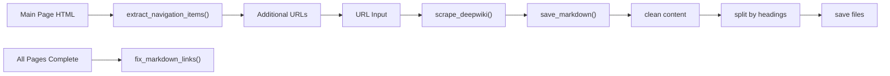

The process begins with direct Markdown fetching through specialized HTTP requests, then cleans and processes the content before saving it as multiple files split by section headings. After all pages are processed, a final link-fixing pass ensures proper cross-references between documents.

Sources:
- [deepwiki_to_md/direct_md_scraper.py:336-383]() - Primary scraping workflow
- [deepwiki_to_md/direct_md_scraper.py:421-530]() - Library processing flow
- [deepwiki_to_md/direct_md_scraper.py:127-281]() - Content processing and saving

## Error Handling

The DirectMarkdownScraper implements comprehensive error handling across all its methods:

| Error Type | Handling Approach |
|------------|-------------------|
| Connection errors | Catch and log error, return None from page |
| Timeouts | Catch and log error, return None from page |
| Request exceptions | Catch and log error, return None from page |
| Value errors | Catch and log error, return None from page |
| Unexpected errors | Catch and log error with traceback, return None from page |

Even when errors occur, the scraper continues with subsequent pages and attempts to fix Markdown links to ensure maximum content recovery.

Sources:
- [deepwiki_to_md/direct_md_scraper.py:258-274]() - Error handling in `scrape_page()`
- [deepwiki_to_md/direct_md_scraper.py:391-422]() - Error handling in `scrape_library()`

## Integration with Link Fixing

After generating Markdown files, the DirectMarkdownScraper ensures links between pages work correctly by running `fix_markdown_links()` on the entire directory after all pages are scraped. This process is called in multiple places to ensure it happens even if errors occur during scraping:

```python
# From scrape_library() method
md_directory = os.path.join(os.getcwd(), self.output_dir, dir_path_part, "md")
logger.info(get_message('starting_fix', directory=md_directory))
fix_markdown_links(md_directory)
```

This approach helps maintain proper navigation between different documentation pages in the resulting Markdown files, replacing external URLs with local references.

Sources:
- [deepwiki_to_md/direct_md_scraper.py:517-519]() - Primary link fixing
- [deepwiki_to_md/direct_md_scraper.py:486-489]() - Link fixing when no navigation items found
- [deepwiki_to_md/direct_md_scraper.py:527-529]() - Link fixing in error case

## Usage

### Direct Usage Example

```python
from deepwiki_to_md.direct_md_scraper import DirectMarkdownScraper

# Initialize the scraper
scraper = DirectMarkdownScraper(output_dir="DirectMarkdownDocuments")

# Define the libraries to scrape
libraries = [
    {"name": "python", "url": "https://deepwiki.com/python/cpython"},
    # Additional libraries can be added here
]

# Run the scraper
results = scraper.run(libraries)
```

Sources:
- [direct_md_example.py:1-15]() - Example usage pattern

## Relationship with DeepwikiScraper

The DirectMarkdownScraper is typically used by the main DeepwikiScraper class as one of several available scraping strategies. When the `use_direct_md_scraper` option is set, DeepwikiScraper will attempt to use this strategy first before falling back to alternatives if needed.

Sources:
- [deepwiki_to_md/direct_md_scraper.py:126-452]() - The entire DirectMarkdownScraper implementation

# DirectDeepwikiScraper

<details>
<summary>Relevant source files</summary>

The following files were used as context for generating this wiki page:

- [README.md](README.md)
- [deepwiki_to_md/deepwiki_to_md.py](deepwiki_to_md/deepwiki_to_md.py)
- [deepwiki_to_md/direct_scraper.py](deepwiki_to_md/direct_scraper.py)

</details>


## Purpose and Scope

The `DirectDeepwikiScraper` is a specialized component of the deepwiki_to_md system designed to scrape content directly from Deepwiki websites by extracting HTML and converting it to Markdown format. This scraper serves as one of the alternative scraping strategies in the system's fallback mechanism.

This document focuses exclusively on the `DirectDeepwikiScraper` class, its methods, and how it processes content. For information about scraping strategy prioritization and how this scraper fits into the broader architecture, see [Scraping Strategy Prioritization](#2.1).

Sources: [deepwiki_to_md/direct_scraper.py:121-522]()

## Class Overview

The `DirectDeepwikiScraper` provides a direct HTML scraping approach that:

1. Extracts content from HTML pages using selective CSS selectors
2. Converts the extracted HTML to Markdown format
3. Saves Markdown content and optionally the original HTML content
4. Traverses navigation structures to scrape complete documentation libraries

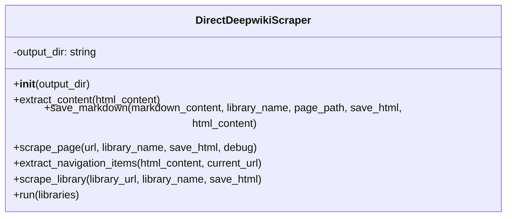

Sources: [deepwiki_to_md/direct_scraper.py:121-130]()

## Core Methods

The DirectDeepwikiScraper implements several key methods that handle different aspects of the content extraction and conversion process:

### Initialization

```python
def __init__(self, output_dir="DynamicDocuments")
```

The constructor initializes the scraper with a configurable output directory where the converted Markdown files will be saved.

Sources: [deepwiki_to_md/direct_scraper.py:97-104]()

### Content Extraction

```python
def extract_content(self, html_content)
```

This method parses the HTML content and extracts the main content section using a prioritized list of CSS selectors. It tries multiple selector patterns to find the main content, falling back to progressively more general selectors if the specific ones fail.

The method returns both the converted Markdown content and the original HTML content.

Sources: [deepwiki_to_md/direct_scraper.py:131-248]()

#### Content Selector Prioritization

The scraper uses a sophisticated selector fallback mechanism to identify the main content of a page:

| Priority | Selector | Description |
|----------|----------|-------------|
| 1 | `main article` | Most specific selector |
| 2 | `main` | Standard HTML5 main element |
| 3 | `main .content` | Common pattern in documentation sites |
| 4 | `article` | Article element |
| 5 | `.content` | Content class |
| 6 | `.article-content` | Article content class |
| ... | ... | ... |
| 14 | `.page-content` | Page content class |

If none of the selectors match, the scraper attempts to identify the div with the most text content.

Sources: [deepwiki_to_md/direct_scraper.py:152-194](), [deepwiki_to_md/direct_scraper.py:197-235]()

### Markdown Saving

```python
def save_markdown(self, markdown_content, library_name, page_path, save_html=False, html_content=None)
```

This method handles saving the extracted Markdown content to the file system. It creates the necessary directory structure and generates appropriate filenames based on the page path. If `save_html` is True and `html_content` is provided, it also saves the original HTML content in a separate directory.

The method includes preprocessing to remove the first 28 lines of the Markdown content, which typically contain header information not needed in the final output.

Sources: [deepwiki_to_md/direct_scraper.py:250-298]()

### Page Scraping

```python
def scrape_page(self, url, library_name, save_html=True, debug=False)
```

This method orchestrates the scraping of an individual page by:
1. Making a request to the URL using the `scrape_deepwiki` function
2. Extracting content from the response using `extract_content`
3. Saving the Markdown content using `save_markdown`
4. Optionally saving the original HTML content if `save_html` is True

It includes error handling and optional debug output.

Sources: [deepwiki_to_md/direct_scraper.py:300-383]()

### Navigation Extraction

```python
def extract_navigation_items(self, html_content, current_url)
```

This method extracts navigation items from the HTML content by finding a specific navigation list element and extracting links. It converts relative URLs to absolute URLs and returns a list of dictionaries containing the title and URL of each navigation item.

Sources: [deepwiki_to_md/direct_scraper.py:385-419]()

### Library Scraping

```python
def scrape_library(self, library_url, library_name, save_html=True)
```

This method handles scraping an entire documentation library by:
1. Scraping the main page
2. Extracting navigation items from the main page
3. Scraping each page linked in the navigation
4. Optionally saving HTML content for each page if `save_html` is True
5. Returning a list of all saved Markdown files

Sources: [deepwiki_to_md/direct_scraper.py:421-492]()

### Execution Method

```python
def run(self, libraries)
```

This is the main entry point method that executes the scraping process for multiple libraries, where each library is a dictionary with "name" and "url" keys.

Sources: [deepwiki_to_md/direct_scraper.py:494-522]()

## Scraping Process Flow

The following diagram illustrates the process flow of the `DirectDeepwikiScraper` when scraping a Deepwiki website:

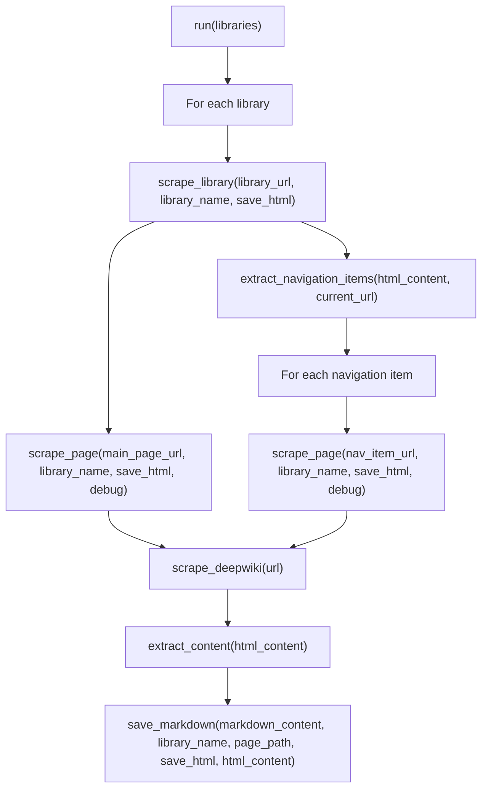

Sources: [deepwiki_to_md/direct_scraper.py:494-522](), [deepwiki_to_md/direct_scraper.py:421-492]()

## Content Extraction Strategy

The `DirectDeepwikiScraper` uses a multi-layered approach to content extraction:

```mermaid
flowchart TD
    A["extract_content(html_content)"] --> B["Parse HTML with BeautifulSoup"]
    B --> C["Try prioritized CSS selectors"]
    C -->|"Found content"| D["Convert to Markdown"]
    C -->|"No content found"| E["Find div with most text content"]
    E -->|"Found content"| D
    E -->|"No content found"| F["Return None"]
    D --> G["Return markdown_content, html_content"]
```

When extracting content, the scraper tries multiple selectors in order of specificity, starting with the most specific selectors like `main article` and progressively falling back to more general selectors. If no selector matches, it attempts to identify the div with the most text content as a fallback mechanism.

Sources: [deepwiki_to_md/direct_scraper.py:131-248]()

## Integration with External Functions

The `DirectDeepwikiScraper` relies on several external functions and libraries:

```mermaid
classDiagram
    class DirectDeepwikiScraper {
        +extract_content()
        +save_markdown()
        +scrape_page()
        +extract_navigation_items()
        +scrape_library()
        +run()
    }
    
    class "scrape_deepwiki()" {
        +Handle HTTP requests
        +Process URL components
        +Debug output
    }
    
    class "BeautifulSoup" {
        +Parse HTML
        +Select elements
    }
    
    class "markdownify" {
        +Convert HTML to Markdown
    }
    
    DirectDeepwikiScraper --> "scrape_deepwiki()"
    DirectDeepwikiScraper --> "BeautifulSoup"
    DirectDeepwikiScraper --> "markdownify"
```

The scraper uses:
- `scrape_deepwiki()` function for making HTTP requests
- BeautifulSoup for HTML parsing and element selection
- markdownify for HTML to Markdown conversion

Sources: [deepwiki_to_md/direct_scraper.py:20-119](), [deepwiki_to_md/direct_scraper.py:6-8]()

## File System Structure

The `DirectDeepwikiScraper` organizes the saved content in a structured directory hierarchy:

```mermaid
graph TD
    A["output_dir (default: DynamicDocuments)"] --> B["library_name 1"]
    A --> C["library_name 2"]
    B --> D["md/"]
    B --> E["html/"]
    D --> F["page1.md"]
    D --> G["page2.md"]
    E --> H["page1.html"]
    E --> I["page2.html"]
```

For each library, the scraper creates:
- A directory with the library name
- A subdirectory for Markdown (`md`) content
- A subdirectory for HTML (`html`) content (only if `save_html=True`)
- Files named based on the last segment of the page path
- HTML files are stored only when `save_html` is enabled

Sources: [deepwiki_to_md/direct_scraper.py:250-298]()

## Usage Example

Here's how to use the `DirectDeepwikiScraper` directly:

```python
# Initialize the scraper with a custom output directory
scraper = DirectDeepwikiScraper(output_dir="docs")

# Scrape a single page and save both Markdown and HTML
scraper.scrape_page("https://deepwiki.example.com/docs/page1", "example_docs", save_html=True)

# Define libraries to scrape
libraries = [
    {"name": "example_docs", "url": "https://deepwiki.example.com/docs"},
    {"name": "api_docs", "url": "https://deepwiki.example.com/api"}
]

# Run the scraper (save_html is True by default)
results = scraper.run(libraries)

# Check results
for library_name, result in results.items():
    print(f"Library: {library_name}")
    print(f"Success: {result['success']}")
    print(f"Files: {len(result['md_files'])}")
```

Sources: [deepwiki_to_md/direct_scraper.py:494-522]()

## Error Handling

The `DirectDeepwikiScraper` implements robust error handling at various levels:

| Method | Error Handling Approach |
|--------|-------------------------|
| `scrape_page` | Catches exceptions, logs detailed error information, and returns None |
| `scrape_library` | If main page scraping fails, returns empty list; if navigation extraction fails, returns only main page |
| `extract_content` | Returns None if main content not found |
| `run` | Records success/failure status for each library |

This multi-layered error handling ensures that the scraper can continue operating even if individual pages or entire libraries fail to scrape properly.

Sources: [deepwiki_to_md/direct_scraper.py:231-302](), [deepwiki_to_md/direct_scraper.py:340-400]()

# Supporting Utilities

<details>
<summary>Relevant source files</summary>

The following files were used as context for generating this wiki page:

- [README.md](README.md)
- [deepwiki_to_md/fix_markdown_links.py](deepwiki_to_md/fix_markdown_links.py)
- [deepwiki_to_md/import_utils.py](deepwiki_to_md/import_utils.py)
- [deepwiki_to_md/md_to_yaml.py](deepwiki_to_md/md_to_yaml.py)

</details>


This document describes the supporting utilities that enable the DeepWiki to Markdown scraping system. These utilities handle specific tasks such as fixing Markdown links, providing a robust module importing system with fallback mechanisms, converting Markdown to YAML format, and supporting internationalization. They complement the core scraping functionality outlined in the [Core Architecture](#2) section.

## Markdown Link Fixing

The Markdown link fixing utility is responsible for cleaning up and standardizing links in the converted Markdown files. This utility ensures consistent link formatting by preserving relative links while replacing external links with empty parentheses.

```mermaid
flowchart TD
    A["fix_markdown_links(directory)"] --> B["Find all .md files in directory"]
    B --> C["For each .md file"]
    C --> D["fix_markdown_links_in_file(file_path)"]
    
    D --> E["Read file content"]
    E --> F["Find all markdown links"]
    F --> G{"Is link external?"}
    G -->|"Yes"| H["Replace with [text]()"]
    G -->|"No"| I["Preserve relative link"]
    H --> J["Write modified content"]
    I --> J
    J --> K["Return count of modified links"]
    
    C --> L["Log total links modified"]
```

The utility implements two primary functions:

1. `fix_markdown_links_in_file(file_path)` - Processes a single Markdown file:
   - Reads the file content
   - Uses regular expressions to identify Markdown links
   - Preserves relative links (those not starting with http:// or https://)
   - Replaces external links with empty parentheses
   - Writes the modified content back to the file
   - Returns the number of links modified

2. `fix_markdown_links(directory)` - Batch processes all Markdown files in a directory:
   - Recursively finds all .md files in the specified directory
   - Calls `fix_markdown_links_in_file` on each file
   - Logs statistics about the process

The link fixing pattern uses a regular expression to match Markdown links in the format `[text](url)` and processes each link according to the rules above.

Sources: [deepwiki_to_md/fix_markdown_links.py:13-68](), [deepwiki_to_md/fix_markdown_links.py:69-99]()

## Module Importing System

The module importing system provides robust imports with fallback mechanisms, ensuring the application can run even when certain modules are unavailable. This utility is particularly useful for maintaining compatibility across different environments and installation configurations.

```mermaid
flowchart TD
    A["import_scraping_modules()"] --> B{"Try absolute import"}
    B -->|"Success"| C["Return real modules"]
    B -->|"Failure"| D{"Try relative import"}
    D -->|"Success"| C
    D -->|"Failure"| E["Return dummy implementations"]
    
    F["import_markdown_link_fixing_modules()"] --> G{"Try absolute import"}
    G -->|"Success"| H["Return real modules"]
    G -->|"Failure"| I{"Try relative import"}
    I -->|"Success"| H
    I -->|"Failure"| J["Return dummy implementations"]
    
    K["import_fix_markdown_links_in_file()"] --> L{"Try absolute import"}
    L -->|"Success"| M["Return real function"]
    L -->|"Failure"| N{"Try relative import"}
    N -->|"Success"| M
    N -->|"Failure"| O["Return dummy function"]
```

The importing system provides three main functions:

1. `import_scraping_modules()` - Imports the key scraping modules:
   - Tries absolute imports first: `from deepwiki_to_md.direct_scraper import ...`
   - Falls back to relative imports: `from .direct_scraper import ...`
   - If both fail, returns dummy implementations with warning logs
   - Returns tuple of `(DirectDeepwikiScraper, scrape_deepwiki, DirectMarkdownScraper)`

2. `import_markdown_link_fixing_modules()` - Imports the Markdown link fixing modules:
   - Follows the same import strategy as above
   - Returns tuple of `(fix_markdown_links, fix_markdown_links_in_file)`

3. `import_fix_markdown_links_in_file()` - Imports only the single file fixing function:
   - Follows the same import strategy
   - Returns just the `fix_markdown_links_in_file` function

When imports fail, the system creates dummy implementations that log appropriate error messages but don't raise exceptions, allowing the application to continue running with reduced functionality.

Sources: [deepwiki_to_md/import_utils.py:11-62](), [deepwiki_to_md/import_utils.py:65-97](), [deepwiki_to_md/import_utils.py:100-127]()

## Integration with Main System

The supporting utilities are integrated into the main DeepWiki scraping system as follows:

```mermaid
classDiagram
    class DeepwikiScraper {
        +scrape_library()
        +fix_markdown_links_in_directory()
    }
    
    class import_utils {
        +import_scraping_modules()
        +import_markdown_link_fixing_modules()
    }
    
    class fix_markdown_links {
        +fix_markdown_links()
        +fix_markdown_links_in_file()
    }
    
    class md_to_yaml {
        +markdown_to_yaml()
        +convert_md_file_to_yaml()
        +html_to_markdown()
        +html_to_yaml()
    }
    
    class localization {
        +get_message()
        +get_system_language()
        +load_messages()
    }
    
    class DirectMarkdownScraper {
        +scrape_page()
        +scrape_library()
    }
    
    class DirectDeepwikiScraper {
        +scrape_page()
        +scrape_library()
    }
    
    DeepwikiScraper --> import_utils : "uses for importing"
    import_utils --> DirectMarkdownScraper : "imports"
    import_utils --> DirectDeepwikiScraper : "imports"
    import_utils --> fix_markdown_links : "imports"
    DeepwikiScraper --> fix_markdown_links : "uses for link fixing"
    DeepwikiScraper --> localization : "uses for messages"
    DirectMarkdownScraper --> localization : "uses for messages"
    DirectDeepwikiScraper --> localization : "uses for messages"
    DeepwikiScraper --> md_to_yaml : "optional conversion"
```

The integrated utilities provide these key features to the main system:

1. **Markdown Link Fixing**: Ensures consistent link formatting in the generated content
2. **Module Importing System**: Provides robust, flexible module loading with fallback mechanisms
3. **Markdown to YAML Conversion**: Enables conversion of scraped content to structured YAML
4. **Internationalization**: Supports multiple languages for user-facing text and messages

The system's modular design allows these utilities to be used independently or as part of the larger scraping workflow.

Sources: [deepwiki_to_md/import_utils.py:11-62](), [deepwiki_to_md/fix_markdown_links.py:14-76](), [deepwiki_to_md/md_to_yaml.py:15-75]()

## Data Flow for Link Processing

The following diagram illustrates the data flow during link processing:

```mermaid
flowchart LR
    A["Raw Markdown with\nExternal Links"] --> B["fix_markdown_links_in_file()"]
    B --> C["Regular Expression\nLink Matcher"]
    C --> D["Link Processor"]
    D --> E["External Link Detector"]
    
    E -->|"External Link"| F["Replace with\nEmpty Parentheses"]
    E -->|"Relative Link"| G["Preserve Link"]
    
    F --> H["Modified Markdown\nwith Cleaned Links"]
    G --> H
```

When processing links, the system:
1. Identifies links using the regular expression pattern `\[([^\]]+)\]\(([^\)]+)\)`
2. Classifies links as external (starting with http:// or https://) or relative
3. Applies the appropriate transformation based on link type
4. Writes the modified content back to the file

Sources: [deepwiki_to_md/fix_markdown_links.py:33-51]()

## Fallback Implementation Structure

When module imports fail, the system creates dummy implementations that maintain the same interface but provide warnings instead of functionality:

```mermaid
classDiagram
    class RealImplementation {
        +function1()
        +function2()
    }
    
    class DummyImplementation {
        +function1() : logs error
        +function2() : logs error
    }
    
    class import_utils {
        +try_import()
        +fallback_to_dummy()
    }
    
    import_utils --> RealImplementation : "imports if available"
    import_utils --> DummyImplementation : "creates if import fails"
```

This approach ensures:
1. The application doesn't crash when a module is missing
2. Clear error messages are logged indicating which functionality is unavailable
3. The core system can continue operating with reduced capabilities

Each dummy implementation maintains the same function signature as the real implementation but logs appropriate error messages and returns default values.

Sources: [deepwiki_to_md/import_utils.py:34-62](), [deepwiki_to_md/import_utils.py:87-97]()

## Markdown to YAML Conversion

The Markdown to YAML conversion utility transforms Markdown content into structured YAML format while preserving the original formatting. This is particularly useful for processing scraped content for Language Learning Models (LLMs).

```mermaid
flowchart TD
    A["markdown_to_yaml(markdown_content)"] --> B["Extract headers, links, structure"]
    B --> C["Count paragraphs, lists, tables"]
    C --> D["Create structured data dict"]
    D --> E["Convert to YAML with yaml.dump()"]
    
    F["convert_md_file_to_yaml(md_file_path, output_dir)"] --> G["Read Markdown file"]
    G --> H["Call markdown_to_yaml()"]
    H --> I["Determine output path"]
    I --> J["Save as YAML file"]
    
    K["html_to_markdown(html_content)"] --> L["Parse HTML with BeautifulSoup"]
    L --> M["Convert to Markdown with markdownify"]
    
    N["html_to_yaml(html_content)"] --> O["Call html_to_markdown()"]
    O --> P["Call markdown_to_yaml()"]
```

The utility provides four main functions:

1. `markdown_to_yaml(markdown_content)` - Converts Markdown string to YAML:
   - Extracts headers, links, and structure metrics
   - Counts paragraphs, lists, and tables
   - Creates a structured dictionary with the content and metadata
   - Converts the dictionary to YAML using yaml.dump()

2. `convert_md_file_to_yaml(md_file_path, output_dir=None)` - Converts a Markdown file to YAML:
   - Reads the Markdown file
   - Calls `markdown_to_yaml()` to convert the content
   - Determines the output path (same directory as input file by default)
   - Saves the YAML content to a file

3. `html_to_markdown(html_content)` - Converts HTML to Markdown:
   - Parses HTML with BeautifulSoup
   - Converts to Markdown using markdownify

4. `html_to_yaml(html_content)` - Converts HTML directly to YAML:
   - Calls `html_to_markdown()` to convert HTML to Markdown
   - Calls `markdown_to_yaml()` to convert Markdown to YAML

The resulting YAML structure includes:
- timestamp: Conversion timestamp
- title: Extracted from first header
- content: Full original Markdown content
- links: List of extracted links with text and URL
- images: List of extracted images (currently empty)
- metadata: Headers, paragraph count, list count, table count

Sources: [deepwiki_to_md/md_to_yaml.py:15-75](), [deepwiki_to_md/md_to_yaml.py:127-165](), [deepwiki_to_md/md_to_yaml.py:81-102](), [deepwiki_to_md/md_to_yaml.py:105-124]()

## Internationalization

The system supports multiple languages through a localization mechanism that loads messages from JSON files based on the detected system language.

```mermaid
flowchart TD
    A["get_message(key, **kwargs)"] --> B["MESSAGES dictionary lookup"]
    B --> C{"Message found in current language?"}
    C -->|"Yes"| D["Return formatted message"]
    C -->|"No"| E{"Message found in default language?"}
    E -->|"Yes"| F["Return default language message"]
    E -->|"No"| G["Return error message"]
    
    H["load_messages()"] --> I["Detect system language"]
    I --> J["Load JSON message files"]
    J --> K["English (en_us.json)"]
    J --> L["Japanese (ja_jp.json)"]
    K --> M["Populate MESSAGES dictionary"]
    L --> M
```

The internationalization system provides several key functions:

1. `get_message(key, **kwargs)` - Retrieves a localized message:
   - Looks up the message key in the MESSAGES dictionary for the current language
   - Falls back to the default language if not found
   - Returns an error message if the key is not found in any language
   - Supports string formatting with the provided kwargs

2. `get_system_language()` - Detects the system language:
   - Uses platform-specific methods to determine the system's language
   - Returns the language code (e.g., "en_us", "ja_jp")

3. `load_messages()` - Loads message definitions:
   - Loads JSON files containing message definitions for different languages
   - Currently supports English (en_us.json) and Japanese (ja_jp.json)
   - Populates the MESSAGES dictionary with the loaded definitions

The system components use `get_message()` to retrieve localized messages for user-facing text, logs, and error messages, ensuring the application can run in multiple languages.

Sources: Based on system diagrams and the Localization System diagram in the provided materials

## Summary Table of Supporting Utilities

| Utility | Main Functions | Purpose |
|---------|---------------|---------|
| Markdown Link Fixing | `fix_markdown_links`, `fix_markdown_links_in_file` | Standardize links in converted Markdown files |
| Module Importing System | `import_scraping_modules`, `import_markdown_link_fixing_modules` | Provide robust imports with fallback mechanisms |

These supporting utilities ensure the DeepWiki to Markdown converter works reliably across different environments and produces clean, consistent output files.

# Markdown Link Fixing

<details>
<summary>Relevant source files</summary>

The following files were used as context for generating this wiki page:

- [README.md](README.md)
- [deepwiki_to_md/fix_markdown_links.py](deepwiki_to_md/fix_markdown_links.py)

</details>


## Purpose

This document details the Markdown link fixing utility within the DeepWiki to Markdown converter system. The utility is responsible for processing links in Markdown files after they have been converted from DeepWiki content. It identifies all Markdown links with non-empty URLs and replaces them with empty-parenthesis links (`[text]()`), effectively removing all URLs from the links while preserving the link text.

For information about the overall conversion process, see [Core Architecture](#2).

## System Overview

The Markdown link fixing utility provides a mechanism to process all Markdown files within a directory, identifying and transforming links based on a predefined pattern. This is crucial for ensuring consistent documentation when converting DeepWiki content to Markdown format.

### Link Fixing Process

```mermaid
flowchart TD
    A["fix_markdown_links(directory)"] --> B["Find all .md files recursively"]
    B --> C["Process each file"]
    C --> E["Read file content"]
    E --> F["Count original links using regex pattern"]
    F --> G["Replace links with empty parentheses"]
    G --> H["Count modified links"]
    H --> K["Write modified content back to file"]
    K --> M["Log results"]
```

Sources: [deepwiki_to_md/fix_markdown_links.py:14-76]()

### Integration with DeepwikiScraper

```mermaid
flowchart LR
    A["DeepwikiScraper"] --> B["Content Extraction"]
    B --> C["HTML to Markdown Conversion"]
    C --> D["fix_markdown_links"]
    D --> E["Save to File System"]
    
    subgraph "Markdown Link Fixing"
    D --> F["fix_markdown_links(directory)"]
    F --> G["Process each .md file"]
    G --> H["Replace links with empty parentheses"]
    end
```

Sources: [deepwiki_to_md/fix_markdown_links.py:14-76]()

## Link Processing Rules

The link fixing system processes all Markdown links with non-empty URLs:

| Link Type | Example | Processing Action |
|-----------|---------|------------------|
| Any Markdown link with URL | `[Text](any-url-here)` | Replaced with `[Text]()` |

All links matching the pattern are transformed by removing the URL while preserving the link text. This approach creates consistent placeholder links throughout the documentation.

Sources: [deepwiki_to_md/fix_markdown_links.py:41-63]()

## Implementation Details

The link fixing system is implemented through a single main function:

### fix_markdown_links Function

This function processes all Markdown files in a directory:

```mermaid
classDiagram
    class "fix_markdown_links" {
        +String directory
        -Check directory exists
        -Find all .md files recursively
        -For each file:
          -Read content
          -Count original links
          -Replace links with empty parentheses
          -Count modified links
          -Write modified content
          -Log results
    }
```

Key implementation steps:
1. Validates the directory exists
2. Recursively finds all `.md` files in the directory using `os.walk()`
3. For each file:
   - Reads the file content
   - Counts the original links using the regex pattern
   - Replaces links with URLs with links having empty parentheses
   - Counts how many links were modified
   - Writes the modified content back to the file
   - Logs the number of modified links

Sources: [deepwiki_to_md/fix_markdown_links.py:14-76]()

## Link Regex Pattern

The system identifies Markdown links using a regular expression pattern:

```
\[([^\]]+)\]\((?![s\)])[^\)]+\)
```

This pattern:
- Matches text enclosed in square brackets `[text]` (capturing the link text as group 1)
- Followed by an opening parenthesis
- The negative lookahead `(?![s\)])` ensures the URL is not empty and doesn't start with certain characters
- Matches one or more characters that are not a closing parenthesis `[^\)]+`
- Followed by a closing parenthesis

The pattern is designed to match Markdown links where the URL part is not empty.

Sources: [deepwiki_to_md/fix_markdown_links.py:41]()

## Link Processing Logic

```mermaid
flowchart TD
    A["Link Pattern Matching"] --> B["Find links matching regex pattern"]
    B --> C["Replace with [text]() using sub() method"]
    C --> D["Count modified links"]
    D --> E["Return modified content"]
```

The regex substitution replaces all matched links with a format that preserves the original text but removes the URL:
```python
modified_content = link_pattern.sub(r'[\1]()', content)
```

Sources: [deepwiki_to_md/fix_markdown_links.py:41-63]()

## Usage

The link fixing functionality can be used standalone or as part of the DeepwikiScraper workflow:

### Standalone Usage

```python
from deepwiki_to_md.fix_markdown_links import fix_markdown_links

# Process all markdown files in a directory
fix_markdown_links("path/to/markdown/files")
```

### Automatic Integration

The link fixing is automatically applied as part of the DeepwikiScraper pipeline after content conversion and before file saving, ensuring all generated Markdown files have properly formatted links.

## Logging

The module implements comprehensive logging to track progress and results:

- Debug level: Details about each modified file
- Info level: Summary statistics (files found, links modified)
- Error level: Issues with file or directory access

This helps with troubleshooting and provides visibility into the link fixing process.

Sources: [deepwiki_to_md/fix_markdown_links.py:5-10](), [deepwiki_to_md/fix_markdown_links.py:66](), [deepwiki_to_md/fix_markdown_links.py:89-98]()

# Module Importing System

<details>
<summary>Relevant source files</summary>

The following files were used as context for generating this wiki page:

- [deepwiki_to_md/deepwiki_to_md.py](deepwiki_to_md/deepwiki_to_md.py)
- [deepwiki_to_md/import_utils.py](deepwiki_to_md/import_utils.py)

</details>


## Purpose and Scope

The Module Importing System is a utility framework designed to handle module imports with graceful fallback mechanisms within the DeepWiki to Markdown converter. This system ensures that the application can operate in various execution contexts (as an installed package or from the source directory) and handles potential import errors elegantly by providing dummy implementations when modules can't be loaded.

For information about how the system fixes links in Markdown files, see [Markdown Link Fixing](#3.1).

Sources: [deepwiki_to_md/import_utils.py:1-127](), [deepwiki_to_md/deepwiki_to_md.py:15-88]()

## Overview

The Module Importing System handles the flexible loading of modules required for the DeepWiki scraping process. It provides a mechanism for importing modules with multiple fallback strategies, preventing crashes when modules are unavailable while providing meaningful substitutes.

```mermaid
flowchart TD
    A["DeepwikiScraper"] -->|"Needs import"| B["import_utils.py functions"]
    
    B -->|"import_scraping_modules()"| C["Try Absolute Import"]
    C -->|"from deepwiki_to_md.direct_scraper"| D{"Success?"}
    
    D -->|"Yes"| E["Return Real Modules"]
    D -->|"No"| F["Try Relative Import"]
    F -->|"from .direct_scraper"| G{"Success?"}
    
    G -->|"Yes"| E
    G -->|"No"| H["Create Dummy Classes"]
    H -->|"DummyDirectDeepwikiScraper"| I["Return Dummy Modules"]
    
    E --> J["Application Uses Real Functionality"]
    I --> K["Application Logs Warnings"]
    
    style A stroke-width:2px
    style B stroke-width:2px
    style E stroke-width:2px
    style I stroke-width:2px
```

**Diagram: Module Importing System Flow**

Sources: [deepwiki_to_md/import_utils.py:11-62](), [deepwiki_to_md/import_utils.py:65-97](), [deepwiki_to_md/import_utils.py:100-127](), [deepwiki_to_md/deepwiki_to_md.py:15-88]()

## Import Functions

The system provides three primary import functions, each targeting specific functionality:

| Function | Purpose | Modules Imported |
|----------|---------|-----------------|
| `import_scraping_modules()` | Imports scraping-related classes and functions | `DirectDeepwikiScraper`, `scrape_deepwiki`, `DirectMarkdownScraper` |
| `import_markdown_link_fixing_modules()` | Imports link fixing utilities | `fix_markdown_links`, `fix_markdown_links_in_file` |
| `import_fix_markdown_links_in_file()` | Imports a single specific function | `fix_markdown_links_in_file` |

Sources: [deepwiki_to_md/import_utils.py:11-17](), [deepwiki_to_md/import_utils.py:65-71](), [deepwiki_to_md/import_utils.py:100-106]()

## Import Mechanism Details

Each import function follows a three-tier strategy to ensure reliable module loading:

```mermaid
sequenceDiagram
    participant DS as "DeepwikiScraper"
    participant IF as "import_scraping_modules()"
    participant AI as "try: from deepwiki_to_md.direct_scraper"
    participant RI as "try: from .direct_scraper"
    participant DI as "Create DummyDirectDeepwikiScraper class"
    
    DS->>IF: Need scraping modules
    IF->>AI: Try absolute import
    
    alt Absolute import succeeds
        AI-->>IF: Return DirectDeepwikiScraper, scrape_deepwiki, DirectMarkdownScraper
        IF-->>DS: Return real modules
    else Absolute import fails (ImportError)
        IF->>RI: Try relative import
        
        alt Relative import succeeds
            RI-->>IF: Return DirectDeepwikiScraper, scrape_deepwiki, DirectMarkdownScraper
            IF-->>DS: Return real modules
        else Relative import fails (ImportError)
            IF->>DI: Create dummy implementations
            DI-->>IF: Return dummy classes and functions
            IF-->>DS: Return usable but non-functional modules
        end
    end
```

**Diagram: Import Function Sequence**

Sources: [deepwiki_to_md/import_utils.py:18-62](), [deepwiki_to_md/import_utils.py:72-97](), [deepwiki_to_md/import_utils.py:107-127](), [deepwiki_to_md/deepwiki_to_md.py:15-45]()

### Absolute Import

The system first attempts to import modules using absolute imports:

```python
from deepwiki_to_md.direct_scraper import DirectDeepwikiScraper, scrape_deepwiki
from deepwiki_to_md.direct_md_scraper import DirectMarkdownScraper
```

Sources: [deepwiki_to_md/import_utils.py:20-21](), [deepwiki_to_md/import_utils.py:74](), [deepwiki_to_md/import_utils.py:109]()

### Relative Import

If absolute import fails, the system attempts relative imports:

```python
from .direct_scraper import DirectDeepwikiScraper, scrape_deepwiki
from .direct_md_scraper import DirectMarkdownScraper
```

Sources: [deepwiki_to_md/import_utils.py:27-28](), [deepwiki_to_md/import_utils.py:80](), [deepwiki_to_md/import_utils.py:115]()

### Dummy Implementations

If both import strategies fail, the system provides dummy implementations that log appropriate warning messages but don't cause the application to crash:

```mermaid
classDiagram
    class DummyDirectDeepwikiScraper {
        +__init__(args, kwargs): void
        +scrape_page(args, kwargs): None
    }
    
    class dummy_scrape_deepwiki {
        +dummy_scrape_deepwiki(url, kwargs): None
    }
    
    class DummyDirectMarkdownScraper {
        +__init__(args, kwargs): void
        +scrape_page(args, kwargs): None
        +scrape_library(args, kwargs): None
    }
    
    class dummy_fix_markdown_links {
        +dummy_fix_markdown_links(directory): void
    }
    
    class dummy_fix_markdown_links_in_file {
        +dummy_fix_markdown_links_in_file(file_path): int
    }
    
    DummyDirectDeepwikiScraper ..> "Logs: DirectDeepwikiScraper is not available"
    dummy_scrape_deepwiki ..> "Logs: scrape_deepwiki function not available"
    DummyDirectMarkdownScraper ..> "Logs: DirectMarkdownScraper is not available"
    dummy_fix_markdown_links ..> "Logs: links not fixed"
    dummy_fix_markdown_links_in_file ..> "Logs: links not fixed"
```

**Diagram: Dummy Implementation Classes and Functions**

Sources: [deepwiki_to_md/import_utils.py:35-60](), [deepwiki_to_md/import_utils.py:87-95](), [deepwiki_to_md/import_utils.py:122-125](), [deepwiki_to_md/deepwiki_to_md.py:25-64]()

## Logging

The Module Importing System includes comprehensive logging to help diagnose import-related issues:

1. Success logging:
   - When modules are successfully imported using absolute imports
   - When modules are successfully imported using relative imports

2. Error logging:
   - When both import strategies fail
   - When dummy implementations are called, indicating underlying import failures

Sources: [deepwiki_to_md/import_utils.py:1-7](), [deepwiki_to_md/import_utils.py:22](), [deepwiki_to_md/import_utils.py:29](), [deepwiki_to_md/import_utils.py:32]()

## Integration with Core Architecture

The Module Importing System serves as a foundational utility for the DeepWiki scraper, ensuring that the system can adapt to different execution environments and handle missing dependencies gracefully.

```mermaid
graph TD
    A["DeepwikiScraper<br>deepwiki_to_md.py"] -->|"Import blocks at<br>lines 15-88"| B["import_utils.py<br>Module Importing System"]
    
    subgraph "import_utils.py Functions"
        C["import_scraping_modules()"]
        D["import_markdown_link_fixing_modules()"]
        E["import_fix_markdown_links_in_file()"]
    end
    
    B -->|"Contains"| C
    B -->|"Contains"| D
    B -->|"Contains"| E
    
    C -->|"Returns real or dummy"| F["DirectDeepwikiScraper<br>direct_scraper.py"]
    C -->|"Returns real or dummy"| G["scrape_deepwiki()<br>direct_scraper.py"]
    C -->|"Returns real or dummy"| H["DirectMarkdownScraper<br>direct_md_scraper.py"]
    
    D -->|"Returns real or dummy"| I["fix_markdown_links()<br>fix_markdown_links.py"]
    D -->|"Returns real or dummy"| J["fix_markdown_links_in_file()<br>fix_markdown_links.py"]
    
    E -->|"Returns real or dummy"| J
    
    F -->|"Used in"| K["scrape_library()<br>line 117-124"]
    G -->|"Used in"| L["scrape_library()<br>line 520-551"]
    H -->|"Used in"| M["scrape_library()<br>line 117-120"]
    I -->|"Used in"| N["scrape_library()<br>line 537-542, 578-580"]
    
    K -->|"Part of"| A
    L -->|"Part of"| A
    M -->|"Part of"| A
    N -->|"Part of"| A
    
    style A stroke-width:2px
    style B stroke-width:2px
    style C stroke-width:2px
    style D stroke-width:2px
    style E stroke-width:2px
```

**Diagram: Module Importing System Integration with DeepwikiScraper**

Sources: [deepwiki_to_md/import_utils.py:11-62](), [deepwiki_to_md/import_utils.py:65-97](), [deepwiki_to_md/import_utils.py:100-127](), [deepwiki_to_md/deepwiki_to_md.py:15-88](), [deepwiki_to_md/deepwiki_to_md.py:450-621]()

## Key Benefits

The Module Importing System provides several important benefits:

1. **Flexibility** - Works in different execution contexts (as a module or standalone)
2. **Robustness** - Gracefully handles missing dependencies without crashing
3. **Diagnostics** - Provides detailed logging about import processes and failures
4. **Modularity** - Separates import concerns from core functionality
5. **Error Isolation** - Prevents import errors from propagating throughout the application

Sources: [deepwiki_to_md/import_utils.py:11-127]()

## Usage Example

Here are examples of how the Module Importing System is used in the actual codebase:

### In-line Import Approach (used in deepwiki_to_md.py)

```python
# Import DirectDeepwikiScraper
try:
    from deepwiki_to_md.direct_scraper import DirectDeepwikiScraper
except ImportError:
    # If the module import fails, try relative import
    try:
        from .direct_scraper import DirectDeepwikiScraper
    except ImportError:
        logging.error("Could not import DirectDeepwikiScraper module")
        # Define a dummy class that does nothing if import fails
        class DirectDeepwikiScraper:
            def __init__(self, *args, **kwargs):
                pass
            def scrape_page(self, *args, **kwargs):
                raise NotImplementedError("DirectDeepwikiScraper is not available.")
```

### Using import_utils.py Approach

```python
# Import modules with fallback
from deepwiki_to_md.import_utils import import_scraping_modules

# Get all scraping modules in one function call
DirectDeepwikiScraper, scrape_deepwiki, DirectMarkdownScraper = import_scraping_modules()

# Use the imported modules knowing they are either real or dummy implementations
scraper = DirectMarkdownScraper(output_dir)
result = scraper.scrape_page(url, name)
```

Note that the application code doesn't need to handle import errors or check if modules exist after using these utilities - the Module Importing System handles that complexity.

Sources: [deepwiki_to_md/import_utils.py:11-62](), [deepwiki_to_md/deepwiki_to_md.py:15-64]()

## Conclusion

The Module Importing System is a critical component that enables the DeepWiki to Markdown converter to operate reliably across various environments. By providing multiple import strategies and graceful fallbacks, it ensures that the application can continue to function even when some components are unavailable, while providing clear diagnostics through its logging system.

# Markdown to YAML Conversion

<details>
<summary>Relevant source files</summary>

The following files were used as context for generating this wiki page:

- [README.md](README.md)
- [deepwiki_to_md/chat.py](deepwiki_to_md/chat.py)
- [deepwiki_to_md/md_to_yaml.py](deepwiki_to_md/md_to_yaml.py)

</details>


The Markdown to YAML conversion utility is a specialized component of the deepwiki-to-md system that enables the transformation of Markdown content into structured YAML format. This utility preserves the original formatting and content while extracting metadata such as headers, links, and structure information. The primary purpose is to facilitate the processing of scraped content for Large Language Models (LLMs) and other applications that benefit from structured data formats.

## Conversion System Overview

The Markdown to YAML conversion system is implemented through several interconnected functions that handle different aspects of the conversion process. The system can convert content directly from Markdown to YAML, or from HTML to YAML via an intermediate Markdown representation.

```mermaid
flowchart TD
    subgraph "Input Sources"
        MD["Markdown Content"]
        HTML["HTML Content"]
        MDFile["Markdown File"]
    end

    subgraph "Conversion Functions"
        MDtoYAML["markdown_to_yaml()"]
        HTMLtoMD["html_to_markdown()"]
        HTMLtoYAML["html_to_yaml()"]
        MDFileToYAML["convert_md_file_to_yaml()"]
    end

    subgraph "Output Formats"
        YAMLString["YAML String"]
        YAMLFile["YAML File"]
    end

    MD --> MDtoYAML
    HTML --> HTMLtoMD --> MDtoYAML
    HTML --> HTMLtoYAML
    MDFile --> MDFileToYAML

    MDtoYAML --> YAMLString
    HTMLtoYAML --> YAMLString
    MDFileToYAML --> YAMLFile
```

Sources: [deepwiki_to_md/md_to_yaml.py:15-78](), [deepwiki_to_md/md_to_yaml.py:81-102](), [deepwiki_to_md/md_to_yaml.py:105-124](), [deepwiki_to_md/md_to_yaml.py:127-165]()

## Implementation Details

The Markdown to YAML conversion functionality is primarily implemented in the `md_to_yaml.py` module, which provides four main functions:

| Function | Description | Input | Output |
|----------|-------------|-------|--------|
| `markdown_to_yaml()` | Converts Markdown content to YAML while preserving formatting | Markdown string | YAML string |
| `html_to_markdown()` | Converts HTML content to Markdown | HTML string | Markdown string |
| `html_to_yaml()` | Converts HTML content to YAML (via Markdown) | HTML string | YAML string |
| `convert_md_file_to_yaml()` | Converts a Markdown file to a YAML file | File path, optional output directory | Path to created YAML file |

### YAML Structure and Metadata Extraction

The conversion process extracts various metadata elements from the Markdown content to create a rich, structured YAML document:

```mermaid
classDiagram
    class "YAML Document" {
        timestamp: String
        title: String
        content: String
        links: Array
        images: Array
        metadata: Object
    }
    
    class "Link" {
        text: String
        url: String
    }
    
    class "Metadata" {
        headers: Array
        paragraphs_count: Number
        lists_count: Number
        tables_count: Number
    }
    
    "YAML Document" --> "Link" : contains
    "YAML Document" --> "Metadata" : contains
```

Sources: [deepwiki_to_md/md_to_yaml.py:15-78]()

### Core Conversion Process

The `markdown_to_yaml()` function is the heart of the conversion system. It processes Markdown content through the following steps:

1. Extract links using regular expressions
2. Extract headers using regular expressions
3. Count paragraphs, lists, and tables
4. Create a structured data dictionary
5. Convert the dictionary to YAML format using PyYAML

```mermaid
flowchart TD
    Start["Input: Markdown Content"] --> Check{"Content Empty?"}
    Check -->|Yes| ReturnNull["Return None"]
    Check -->|No| Process["Process Content"]
    
    Process --> ExtractLinks["Extract Links\n(regex pattern)"]
    Process --> ExtractHeaders["Extract Headers\n(regex pattern)"]
    Process --> CountElements["Count Paragraphs,\nLists, Tables"]
    
    ExtractLinks --> CreateDict["Create Data Dictionary"]
    ExtractHeaders --> CreateDict
    CountElements --> CreateDict
    
    CreateDict --> ToYAML["Convert to YAML\n(yaml.dump)"]
    ToYAML --> End["Return YAML String"]
```

Sources: [deepwiki_to_md/md_to_yaml.py:15-78]()

## Integration with Chat Scraping

The Markdown to YAML conversion functionality is integrated with the chat scraping feature of the system, allowing chat responses to be saved in various formats, including YAML:

```mermaid
flowchart LR
    subgraph "ChatScraperSelenium"
        SendMessage["send_chat_message()"]
        ExtractHTML["_extract_response_html()"]
        SaveResponse["_save_response()"]
        
        HTMLtoMD["_html_to_markdown()"]
        HTMLtoYAML["_html_to_yaml()"]
        MDtoYAML["_markdown_to_yaml()"]
    end
    
    subgraph "md_to_yaml Module"
        modHTML2MD["html_to_markdown()"]
        modHTML2YAML["html_to_yaml()"]
        modMD2YAML["markdown_to_yaml()"]
    end
    
    SendMessage --> ExtractHTML
    ExtractHTML --> SaveResponse
    
    SaveResponse --> HTMLtoMD
    SaveResponse --> HTMLtoYAML
    SaveResponse --> MDtoYAML
    
    HTMLtoMD --> modHTML2MD
    HTMLtoYAML --> modHTML2YAML
    MDtoYAML --> modMD2YAML
    
    modHTML2MD --> modMD2YAML
    modHTML2YAML --> modHTML2MD
```

Sources: [deepwiki_to_md/chat.py:262-296](), [deepwiki_to_md/chat.py:298-354]()

## Usage

The Markdown to YAML conversion utility can be used in different ways:

### Command-Line Interface

The utility can be accessed through the command-line interface:

```bash
python -m deepwiki_to_md.chat convert --md "path/to/markdown/file.md"
```

To specify a custom output directory:

```bash
python -m deepwiki_to_md.chat convert --md "path/to/markdown/file.md" --output "path/to/output/directory"
```

Sources: [deepwiki_to_md/chat.py:375-422](), [deepwiki_to_md/chat.py:432-444]()

### Python API

The utility can also be used programmatically:

```python
from deepwiki_to_md.md_to_yaml import convert_md_file_to_yaml, markdown_to_yaml

# Convert a Markdown file to YAML
yaml_file_path = convert_md_file_to_yaml("path/to/markdown/file.md")

# Convert a Markdown file to YAML with a custom output directory
yaml_file_path = convert_md_file_to_yaml("path/to/markdown/file.md", "path/to/output/directory")

# Or convert a Markdown string directly to a YAML string
markdown_string = "# My Document\n\nThis is the content."
yaml_string = markdown_to_yaml(markdown_string)
```

Sources: [README.md:395-407]()

### Integration with Chat Scraping

When using the chat scraping feature, you can specify YAML as one of the output formats:

```bash
python -m deepwiki_to_md.chat --url "https://deepwiki.com/some_chat_page" --message "Your message" --format "yaml"
```

To save in multiple formats simultaneously:

```bash
python -m deepwiki_to_md.chat --url "https://deepwiki.com/some_chat_page" --message "Your message" --format "html,md,yaml"
```

Sources: [deepwiki_to_md/chat.py:29-56](), [deepwiki_to_md/chat.py:306-354]()

## YAML Output Structure

The converted YAML file includes a structured representation of the document while embedding the original Markdown content:

```yaml
timestamp: 'YYYY-MM-DD HH:MM:SS'  # Timestamp of the conversion
title: Extracted Document Title    # Title extracted from the first header
content: |
  # Original Title
  ## Section 1

  Content of section 1.

  * List item 1
  * List item 2

  ## Section 2

  Content of section 2.
  ...                              # Full original Markdown content is preserved
links:
  - text: Link Text
    url: url                       # List of links extracted from the Markdown
images: [ ]                         # List of images extracted (currently empty)
metadata:
  headers:                         # List of all header texts
    - Original Title
    - Section 1
    - Section 2
    ...
  paragraphs_count: 5              # Count of paragraphs
  lists_count: 1                   # Count of lists
  tables_count: 0                  # Count of tables
```

Sources: [README.md:415-448]()

## System Dependencies

The Markdown to YAML conversion functionality depends on the following external libraries:

1. `pyyaml`: For converting Python dictionaries to YAML format
2. `beautifulsoup4`: For parsing HTML content (when converting from HTML)
3. `markdownify`: For converting HTML to Markdown (when converting from HTML)

Note that `pyyaml` is listed as an optional dependency in the package and must be installed separately if you're using the core package installation.

Sources: [README.md:25-36]()

# Internationalization

<details>
<summary>Relevant source files</summary>

The following files were used as context for generating this wiki page:

- [deepwiki_to_md/lang/en_us.json](deepwiki_to_md/lang/en_us.json)
- [deepwiki_to_md/lang/ja_jp.json](deepwiki_to_md/lang/ja_jp.json)
- [deepwiki_to_md/localization.py](deepwiki_to_md/localization.py)

</details>


## Purpose and Scope

This document describes the internationalization (i18n) system implemented in the deepwiki-to-md project. The system provides localization capabilities, enabling the application to present user-facing messages in multiple languages based on the user's system settings. This document covers the core localization infrastructure, supported languages, message storage, retrieval mechanisms, and how the system handles fallback scenarios.

## Overview

The internationalization system in deepwiki-to-md follows a straightforward approach focused on message translation and runtime language detection. The system detects the user's system language settings and delivers messages in the appropriate language when available. It includes robust fallback mechanisms to ensure the application continues to function properly even when translations are missing.

### Localization System Architecture

```mermaid
graph TD
    subgraph "Application Components"
        DS["DeepwikiScraper"]
        DMS["DirectMarkdownScraper"]
        DDS["DirectDeepwikiScraper"]
        LF["Markdown Link Fixer"]
        RC["RepositoryCreator"]
        CS["ChatScraper"]
    end

    subgraph "Localization System"
        GM["get_message(key, **kwargs)"]
        GSL["get_system_language()"]
        LM["load_messages()"]

        GSL --> LNG["System Language Detection"]
        LM --> MsgDict["MESSAGES Dictionary"]
        LNG --> GM
        MsgDict --> GM
    end

    subgraph "Message Storage"
        EN["en_us.json\n(English Messages)"]
        JA["ja_jp.json\n(Japanese Messages)"]
        
        EN --> MsgDict
        JA --> MsgDict
    end

    DS --> GM
    DMS --> GM
    DDS --> GM
    LF --> GM
    RC --> GM
    CS --> GM
    
    GM --> DS
    GM --> DMS
    GM --> DDS
    GM --> LF
    GM --> RC
    GM --> CS
```

Sources: [deepwiki_to_md/localization.py:1-148]()

## Core Components

### Message Storage

The system stores localized messages in JSON files within the `lang` directory. Each language has its own file (e.g., `en_us.json` for English, `ja_jp.json` for Japanese). These files contain key-value pairs where:

- The **key** is a unique identifier for the message (e.g., `"scraping_completed"`)
- The **value** is the translated message text with optional placeholders for dynamic content

For example, in the English and Japanese message files:

**English (`en_us.json`)**:
```json
"scraping_completed": "Scraping completed successfully. Markdown files saved to {output_dir}"
```

**Japanese (`ja_jp.json`)**:
```json
"scraping_completed": "スクレイピングが完了しました。Markdownファイルは{output_dir}に保存されました。"
```

Sources: [deepwiki_to_md/lang/en_us.json:1-64](), [deepwiki_to_md/lang/ja_jp.json:1-64]()

### Supported Languages

Currently, the system supports two languages:

1. **English (en_us)** - Default language
2. **Japanese (ja_jp)**

The `SUPPORTED_LANGUAGES` dictionary maps various locale codes to normalized language codes:

```mermaid
graph LR
    subgraph "System Locale Codes"
        en["en"]
        en_US["en_US"]
        ja["ja"]
        ja_JP["ja_JP"]
    end
    
    subgraph "Normalized Language Codes"
        en_us["en_us"]
        ja_jp["ja_jp"]
    end
    
    en --> en_us
    en_US --> en_us
    ja --> ja_jp
    ja_JP --> ja_jp
```

Sources: [deepwiki_to_md/localization.py:18-24]()

### Language Detection

The system detects the user's language using the Python `locale` module. The `get_system_language()` function:

1. Calls `locale.getdefaultlocale()` to get the system's language setting
2. Maps the system language to a supported language code
3. Falls back to English (default language) if the system language is not supported

```mermaid
flowchart TD
    Start["get_system_language()"] --> GetLocale["Get system locale with\nlocale.getdefaultlocale()"]
    GetLocale --> CheckNull{Is locale null?}
    CheckNull -->|Yes| ReturnDefault["Return DEFAULT_LANGUAGE\n(en_us)"]
    
    CheckNull -->|No| LoopLanguages["Check against\nSUPPORTED_LANGUAGES"]
    LoopLanguages --> IsSupported{Is language\nsupported?}
    
    IsSupported -->|Yes| ReturnNormalized["Return normalized\nlanguage code"]
    IsSupported -->|No| ReturnDefault
    
    ReturnNormalized --> End
    ReturnDefault --> End
```

Sources: [deepwiki_to_md/localization.py:66-90]()

## Message Retrieval and Fallback System

### The `get_message` Function

The heart of the localization system is the `get_message` function, which retrieves messages based on their key and handles all fallbacks:

```python
get_message(key: str, **kwargs: Any) -> str
```

This function accepts:
- A message key to look up
- Optional keyword arguments for formatting message placeholders

### Message Lookup Process

The lookup process follows a series of fallback steps to ensure robustness:

```mermaid
flowchart TD
    Start["get_message(key, **kwargs)"] --> GetLang["Get current language\nwith get_system_language()"]
    GetLang --> GetMessages["Get messages for\ncurrent language"]
    
    GetMessages --> HasMessages{Messages\nexist?}
    HasMessages -->|No| GetDefault["Try default language\n(en_us)"]
    HasMessages -->|Yes| LookupKey["Look up key in\nmessages dictionary"]
    
    GetDefault --> DefaultExists{Default\nexists?}
    DefaultExists -->|No| ReturnMissing["Return missing\nmessage error"]
    DefaultExists -->|Yes| LookupKey
    
    LookupKey --> KeyFound{Key found?}
    KeyFound -->|No| TryDefault["Try to find key in\ndefault language"]
    KeyFound -->|Yes| HasArgs{Has format\narguments?}
    
    TryDefault --> DefaultKeyFound{Found in\ndefault?}
    DefaultKeyFound -->|No| ReturnUnknown["Return unknown\nkey error"]
    DefaultKeyFound -->|Yes| HasArgs
    
    HasArgs -->|No| ReturnMessage["Return message as is"]
    HasArgs -->|Yes| TryFormat["Try to format message\nwith arguments"]
    
    TryFormat --> FormatSuccess{Format\nsuccess?}
    FormatSuccess -->|Yes| ReturnFormatted["Return formatted\nmessage"]
    FormatSuccess -->|No| ReturnError["Return message with\nformat error info"]
    
    ReturnFormatted --> End
    ReturnMessage --> End
    ReturnUnknown --> End
    ReturnError --> End
    ReturnMissing --> End
```

Sources: [deepwiki_to_md/localization.py:93-147]()

### Error Handling and Logging

The localization system includes comprehensive error handling to prevent application crashes:

1. **Missing messages**: If a message key is not found, the system returns a descriptive error message
2. **Formatting errors**: If message formatting fails, the system returns the unformatted message with an error indicator
3. **Exception handling**: Catches any unexpected errors to prevent application crashes
4. **Logging**: Uses Python's logging module to log warnings and errors for debugging

## Integration with Application Components

The localization system is integrated with various components of the deepwiki-to-md application:

```mermaid
graph TD
    subgraph "Core Components"
        DS["DeepwikiScraper\n(deepwiki_to_md.py)"]
        DMS["DirectMarkdownScraper\n(direct_md_scraper.py)"]
        DDS["DirectDeepwikiScraper\n(direct_scraper.py)"]
    end
    
    subgraph "Utility Components"
        LF["Markdown Link Fixer\n(fix_markdown_links.py)"]
        RC["RepositoryCreator\n(create.py)"]
        CS["ChatScraper\n(chat.py)"]
    end
    
    subgraph "Localization System"
        LOC["localization.py"]
    end
    
    subgraph "Message Files"
        EN["en_us.json"]
        JA["ja_jp.json"]
    end
    
    EN --> LOC
    JA --> LOC
    
    LOC --> DS
    LOC --> DMS
    LOC --> DDS
    LOC --> LF
    LOC --> RC
    LOC --> CS
```

Sources: [deepwiki_to_md/localization.py:1-148]()

## Message Categories

The message files contain translations for various categories of messages:

| Category | Description | Example Keys |
|----------|-------------|--------------|
| CLI Options | Help text for command-line options | `library_help`, `output_dir_help` |
| Status Messages | Information about operation progress | `scraping_completed`, `processing_file` |
| Error Messages | Error descriptions | `error`, `library_required_error` |
| Log Messages | Detailed operation information | `starting_library_scrape`, `using_direct_scraper` |

Sources: [deepwiki_to_md/lang/en_us.json:1-64](), [deepwiki_to_md/lang/ja_jp.json:1-64]()

## Usage Example

Here's how the localization system is used in the application code:

```python
from deepwiki_to_md.localization import get_message

# Simple message
print(get_message("scraping_library", library_name="Example Library"))

# Message with formatting
output_dir = "/path/to/output"
print(get_message("scraping_completed", output_dir=output_dir))

# Error message
try:
    # Some operation
    pass
except Exception as e:
    print(get_message("error", error=str(e)))
```

The output will be shown in the user's system language (if supported) or in English (as a fallback).

Sources: [deepwiki_to_md/localization.py:93-147]()

## Future Expansion

The internationalization system is designed to be easily extended with additional languages:

1. Create a new JSON file in the `lang` directory (e.g., `fr_fr.json` for French)
2. Translate all message keys from the English file
3. Add the new language code to the `SUPPORTED_LANGUAGES` dictionary in `localization.py`

No code changes are required in the message retrieval logic, as it will automatically detect and use the new language file based on the user's system settings.

Sources: [deepwiki_to_md/localization.py:18-24](), [deepwiki_to_md/localization.py:27-59]()

# Usage Guide

<details>
<summary>Relevant source files</summary>

The following files were used as context for generating this wiki page:

- [README.md](README.md)
- [deepwiki_to_md/run_direct_scraper.py](deepwiki_to_md/run_direct_scraper.py)
- [deepwiki_to_md/run_scraper.py](deepwiki_to_md/run_scraper.py)

</details>


This document provides comprehensive instructions for using the deepwiki-to-md tool, which scrapes content from Deepwiki websites and converts it to Markdown format. The guide covers the command-line interfaces, Python API usage, and specialized tools included in the package.

For an overview of the system's architecture, see [Overview](#1). For information about the core components, see [Core Architecture](#2).

## Installation

There are two methods to install the deepwiki-to-md tool:

### Option 1: Install from PyPI

```bash
pip install deepwiki-to-md
```

This installs the core dependencies listed in setup.py. Note that `selenium`, `webdriver-manager`, and `pyyaml` are not included by default. Install them manually if you need the chat scraping or YAML conversion features.

### Option 2: Install from Source

```bash
git clone https://github.com/yuyu1815/deepwiki_to_md.git
cd deepwiki_to_md
pip install -e . -r requirements.txt
```

Installing with requirements.txt includes all dependencies needed for all features.

Sources: [README.md:24-43]()

## Command Line Interface

The command-line interface provides a convenient way to use the tool without writing Python code.

### Basic Syntax

The general command pattern is:

```bash
deepwiki-to-md [options] "URL"
```

If installed from source, you can also run:

```bash
python -m deepwiki_to_md.run_scraper [options] "URL"
```

### Available Options

For `deepwiki-to-md` or `python -m deepwiki_to_md.run_scraper`:

| Option | Shorthand | Description | Default |
|--------|-----------|-------------|---------|
| `library_url` | N/A | URL of the library to scrape (positional argument) | None |
| `--library`, `-l` | `-l` | Library name and URL to scrape (can specify multiple times) | Extracted from URL |
| `--output-dir`, `-o` | `-o` | Output directory for Markdown files | "Documents" |
| `--use-direct-scraper` | N/A | Use DirectDeepwikiScraper (HTML to Markdown) | False |
| `--no-direct-scraper` | N/A | Disable DirectDeepwikiScraper | False |
| `--use-alternative-scraper` | N/A | Use alternate scraper as fallback | True |
| `--no-alternative-scraper` | N/A | Disable alternative scraper | False |
| `--use-direct-md-scraper` | N/A | Use DirectMarkdownScraper (direct MD fetching) | True |
| `--no-direct-md-scraper` | N/A | Disable DirectMarkdownScraper | False |

#### Scraper Priority:

- If `--use-direct-scraper` is specified, DirectDeepwikiScraper (HTML to Markdown) is used.
- If `--use-direct-md-scraper` is specified (and `--use-direct-scraper` is not), DirectMarkdownScraper is used.
- If neither is specified, DirectMarkdownScraper is used by default.
- The `--use-alternative-scraper` flag controls a fallback mechanism within the chosen primary scraper.

Sources: [README.md:138-149]()

### Command-Line Usage Flow

This diagram shows the workflow when using the command-line interface:

```mermaid
flowchart TD
    A["Command Execution"] --> B["Parse CLI Arguments"]
    B --> C["Initialize DeepwikiScraper"]
    C --> D["Run Scraping Process"]
    D --> E["Process Each Library URL"]
    E --> F["Extract Navigation Items"]
    F --> G["Extract Content"]
    G --> H["Convert to Markdown"]
    H --> I["Save Files to Output Directory"]
    I --> J["Fix Markdown Links"]
```

Sources: [deepwiki_to_md/deepwiki_to_md.py:49-80](), [README.md:152-220]()

### Command-Line Examples

1. Scrape a single URL with automatic library name detection:
   ```bash
   deepwiki-to-md "https://deepwiki.com/python/cpython"
   ```

2. Scrape with an explicit library name:
   ```bash
   deepwiki-to-md --library "python" "https://deepwiki.com/python/cpython"
   ```

3. Scrape multiple libraries:
   ```bash
   deepwiki-to-md --library "python" "https://deepwiki.com/python/cpython" --library "javascript" "https://deepwiki.com/javascript"
   ```

4. Specify a custom output directory:
   ```bash
   deepwiki-to-md "https://deepwiki.com/python/cpython" --output-dir "PythonDocs"
   ```

5. Use DirectMarkdownScraper (for best quality Markdown):
   ```bash
   deepwiki-to-md "https://deepwiki.com/python/cpython" --use-direct-md-scraper
   ```

Sources: [README.md:152-220]()

## Python API

The Python API provides programmatic access to the same functionality as the command-line interface but with more flexibility for custom workflows.

### DeepwikiScraper Configuration

When initializing `DeepwikiScraper`, you can specify several options:

```python
from deepwiki_to_md import DeepwikiScraper

scraper = DeepwikiScraper(
    output_dir="Documents",               # Output directory for Markdown files
    use_direct_scraper=False,             # Whether to use DirectDeepwikiScraper
    use_alternative_scraper=False,        # Whether to use scrape_deepwiki
    use_direct_md_scraper=True            # Whether to use DirectMarkdownScraper
)
```

Sources: [deepwiki_to_md/deepwiki_to_md.py:49-80]()

### Scraping Strategy Priority

The `DeepwikiScraper` class implements a priority-based approach to scraping. The following diagram illustrates how the different scraping strategies are prioritized:

```mermaid
flowchart TD
    A["DeepwikiScraper.scrape_library()"] --> B{"use_direct_md_scraper?"}
    B -->|"Yes"| C["DirectMarkdownScraper.scrape_library()"]
    B -->|"No"| D{"use_alternative_scraper?"}
    C -->|"Success"| Z["Return"]
    C -->|"Failure"| D
    D -->|"Yes"| E["scrape_deepwiki()"]
    D -->|"No"| F{"use_direct_scraper?"}
    E -->|"Success"| Z
    E -->|"Failure"| F
    F -->|"Yes"| G["DirectDeepwikiScraper.scrape_page()"]
    F -->|"No"| H["Standard Scraping"]
    G --> Z
    H --> Z
```

Sources: [deepwiki_to_md/deepwiki_to_md.py:381-520]()

### Key Methods

The primary methods for using the Python API are:

| Method | Description |
|--------|-------------|
| `scrape_library(library_name, library_url)` | Scrapes a single library |
| `run(libraries)` | Scrapes multiple libraries |
| `extract_navigation_items(html_content, current_url)` | Extracts navigation items from HTML |
| `extract_content(html_content, url, library_name)` | Extracts main content from HTML |
| `html_to_markdown(html_element)` | Converts HTML to Markdown |
| `save_markdown(library_name, title, markdown_content, path)` | Saves Markdown content to file |
| `fix_markdown_links_in_directory(path)` | Fixes Markdown links in the output directory |

Sources: [deepwiki_to_md/deepwiki_to_md.py:184-539]()

### Python API Component Interaction

This diagram shows how the components interact when using the Python API:

```mermaid
sequenceDiagram
    participant User as "Your Code"
    participant DS as "DeepwikiScraper"
    participant DMS as "DirectMarkdownScraper"
    participant DDS as "DirectDeepwikiScraper"
    participant Web as "Deepwiki Website"
    participant FS as "File System"
    
    User->>DS: Create with options
    User->>DS: run(libraries) or scrape_library(name, url)
    
    alt use_direct_md_scraper is True
        DS->>DMS: scrape_library(url, name)
        DMS->>Web: Request content
        Web-->>DMS: Return Markdown content
        DMS->>FS: Save Markdown files
    else use_alternative_scraper is True
        DS->>Web: scrape_deepwiki(url)
        Web-->>DS: Return content
        DS->>DS: Process HTML
        DS->>FS: Save as Markdown
    else use_direct_scraper is True
        DS->>DDS: scrape_page(url, name)
        DDS->>Web: Request content
        Web-->>DDS: Return HTML content
        DDS->>DS: Return processed content
        DS->>FS: Save as Markdown
    else standard method (fallback)
        DS->>Web: Get main page
        Web-->>DS: Return HTML
        DS->>DS: Extract navigation items
        loop For each navigation item
            DS->>Web: Get page content
            Web-->>DS: Return HTML
            DS->>DS: extract_content() and html_to_markdown()
            DS->>FS: save_markdown()
        end
    end
    
    DS->>DS: fix_markdown_links_in_directory()
```

Sources: [deepwiki_to_md/deepwiki_to_md.py:381-539]()

### Python API Examples

#### Basic Usage

```python
from deepwiki_to_md import DeepwikiScraper

# Create a scraper instance (DirectMarkdownScraper is used by default)
scraper = DeepwikiScraper(output_dir="MyDocuments")

# Scrape a single library
scraper.scrape_library("python", "https://deepwiki.com/python/cpython")

# Scrape multiple libraries
libraries = [
    {"name": "python", "url": "https://deepwiki.com/python/cpython"},
    {"name": "javascript", "url": "https://deepwiki.com/javascript"}
]
scraper.run(libraries)
```

#### Using DirectMarkdownScraper Explicitly (Direct Markdown Fetching)

```python
from deepwiki_to_md import DeepwikiScraper

# Create a scraper with DirectMarkdownScraper explicitly enabled
scraper = DeepwikiScraper(
    output_dir="DirectMarkdownDocuments",
    use_direct_scraper=False,
    use_alternative_scraper=False,
    use_direct_md_scraper=True  # Enable DirectMarkdownScraper (this is the default)
)

# Scrape a library
scraper.scrape_library("rust", "https://deepwiki.com/rust")
```

#### Using DirectDeepwikiScraper Explicitly (HTML to Markdown)

```python
from deepwiki_to_md import DeepwikiScraper

# Create a scraper with DirectDeepwikiScraper explicitly enabled
scraper = DeepwikiScraper(
    output_dir="HtmlScrapedDocuments",
    use_direct_scraper=True,  # Enable DirectDeepwikiScraper
    use_alternative_scraper=False,  # Disable alternative fallback for clarity
    use_direct_md_scraper=False  # Disable DirectMarkdownScraper
)

# Scrape a library
scraper.scrape_library("go", "https://deepwiki.com/go")
```

#### Using Individual Direct Scrapers

```python
from deepwiki_to_md.direct_scraper import DirectDeepwikiScraper  # For HTML -> MD
from deepwiki_to_md.direct_md_scraper import DirectMarkdownScraper  # For Direct MD

# Create a DirectDeepwikiScraper instance (HTML to Markdown)
direct_html_scraper = DirectDeepwikiScraper(output_dir="DirectHtmlScraped")

# Scrape a specific page directly (HTML to Markdown)
direct_html_scraper.scrape_page(
    "https://deepwiki.com/python/cpython/bytecode-interpreter",
    "python_bytecode",  # Library name/path part for output folder
    save_html=True  # Optionally save the original HTML
)

# Create a DirectMarkdownScraper instance (Direct Markdown Fetching)
direct_md_scraper = DirectMarkdownScraper(output_dir="DirectMarkdownFetched")

# Scrape a specific page directly as Markdown
direct_md_scraper.scrape_page(
   "https://deepwiki.com/python/cpython/bytecode-interpreter",
    "python_bytecode"  # Library name/path part for output folder
)
```

Sources: [README.md:118-182]()

Sources: [example.py:26-47](), [README.md:77-130]()

## Output Structure

The converted Markdown files are saved in a specific directory structure:

```mermaid
graph TD
    A["Current Working Directory"] --> B["output_dir (Default: Documents)"]
    B --> C["library_name1"]
    B --> D["library_name2"]
    C --> E["md"]
    C --> HTML["html (if --save-html used)"]
    D --> F["md"]
    E --> G["page1.md"]
    E --> H["page2.md"]
    HTML --> HTMLG["page1.html"]
    HTML --> HTMLH["page2.html"]
    F --> I["page1.md"]
    F --> J["page2.md"]
```

The structure follows this pattern:
```
<output_dir>/
├── <library_name1>/
│   └── md/
│       ├── <page_name1>.md
│       ├── <page_name2>.md
│       └── ...
│   └── html/ # Only if --save-html is used with DirectDeepwikiScraper
│       ├── <page_name1>.html
│       ├── <page_name2>.html
│       └── ...
├── <library_name2>/
...
```

- `<output_dir>` is the directory specified by `--output-dir` (default: "Documents" for run_scraper.py, "DynamicDocuments" for run_direct_scraper.py)
- `<library_name>` is the name provided for the library (or inferred from the URL path)
- Each page is saved as a separate .md file within the md subdirectory
- Original HTML is saved in the html subdirectory if the `--save-html` option is used with DirectDeepwikiScraper

Sources: [README.md:311-339]()

## Troubleshooting

### Common Issues

1. **Connection Problems**:
   - The tool checks if domains are reachable before attempting to connect.
   - If a domain is unreachable, you'll see an error message.
   - Make sure you have internet connectivity and that the domain exists.

2. **Content Not Found**:
   - If the tool fails to extract navigation items or content, it will log warnings.
   - The tool will attempt multiple selector patterns to find content.
   - If all selectors fail, it will try to find the largest text container.

3. **Scraping Strategy Fallbacks**:
   - If a scraping strategy fails, the tool will automatically fall back to the next available strategy.
   - Check logs for information about which strategy was used and any failures.

Sources: [deepwiki_to_md/deepwiki_to_md.py:89-116](), [deepwiki_to_md/deepwiki_to_md.py:219-277]()

### Best Practices

1. **Strategy Selection**:
   - Use `DirectMarkdownScraper` (--use-direct-md-scraper) for the highest quality Markdown output.
   - Use `DirectDeepwikiScraper` (--use-direct-scraper) as a second choice.
   - The standard scraping method is the most generic but may produce lower quality output.

2. **Library Organization**:
   - Organize your scraping by logical library names to maintain a clean output structure.
   - Use consistent naming conventions for libraries to avoid confusion.

3. **Error Handling**:
   - The tool implements retry mechanisms with exponential backoff for transient errors.
   - If you encounter persistent errors, try the different scraping strategies.

Sources: [deepwiki_to_md/deepwiki_to_md.py:49-67](), [README.md:242-290]()

## Conclusion

The deepwiki_to_md tool provides flexible and robust ways to scrape content from Deepwiki sites and convert it to Markdown format. Whether you use the command-line interface or the Python API, you can customize the scraping process to suit your needs. The tool prioritizes different scraping strategies to ensure the best possible results, with DirectMarkdownScraper being the recommended approach for highest quality output.

Sources: [README.md:5-15](), [deepwiki_to_md/deepwiki_to_md.py:49-67]()

# Command Line Interface

<details>
<summary>Relevant source files</summary>

The following files were used as context for generating this wiki page:

- [README.md](README.md)
- [deepwiki_to_md/chat.py](deepwiki_to_md/chat.py)
- [deepwiki_to_md/run_direct_scraper.py](deepwiki_to_md/run_direct_scraper.py)
- [deepwiki_to_md/run_scraper.py](deepwiki_to_md/run_scraper.py)

</details>


This document details the command-line interfaces (CLI) for the deepwiki_to_md package, which allows users to access various functionalities without writing Python code. For information about using the tool as a Python library, see [Python API](#4.2).

## Overview

The deepwiki_to_md package provides multiple command-line tools:

1. **deepwiki-to-md** (run_scraper.py): The main scraper for converting Deepwiki content to Markdown
2. **run_direct_scraper.py**: A simplified interface specifically for the DirectDeepwikiScraper
3. **deepwiki-create** (create.py): A tool for creating repository requests
4. **deepwiki-chat** (chat.py): A tool for scraping chat responses and format conversion

Together, these tools provide a comprehensive set of capabilities for interacting with Deepwiki content.

### Command-Line Tool Structure

```mermaid
flowchart TD
    User([User]) --> |executes| CLIs[Command Line Interfaces]
    
    subgraph "Command Line Interfaces"
        DW["deepwiki-to-md<br>(run_scraper.py)"]
        RDS["run_direct_scraper.py"]
        DC["deepwiki-create<br>(create.py)"]
        DCH["deepwiki-chat<br>(chat.py)"]
    end
    
    DW --> |creates| DWS["DeepwikiScraper"]
    RDS --> |creates| DDWS["DirectDeepwikiScraper"]
    DC --> |creates| RC["RepositoryCreator"]
    
    DCH --> |chat mode| CS["ChatScraperSelenium"]
    DCH --> |convert mode| MY["md_to_yaml functions"]
    
    subgraph "Core Components"
        DWS
        DDWS
        RC
        CS
        MY
    end
    
    DWS --> |uses| DDWS
    DWS --> |uses| DMS["DirectMarkdownScraper"]
    DWS --> |uses| FML["fix_markdown_links"]
    
    CS --> |generates| Output["Output Files"]
    MY --> |generates| YAML["YAML Files"]
    DWS --> |generates| MD["Markdown Files"]
    DDWS --> |generates| MD
    
    subgraph "Output Files"
        MD
        HTML["HTML Files"]
        YAML
    end
    
    DDWS --> |can generate| HTML
```

Sources: [README.md:46-216](), [run_scraper.py:1-108](), [run_direct_scraper.py:1-82](), [chat.py:1-507]()

## Installation

Before using the CLI, you must install the package using one of these methods:

### From PyPI (Recommended)

```bash
pip install deepwiki-to-md
```

After installation, the `deepwiki-to-md` command becomes available.

### From Source

```bash
git clone https://github.com/yuyu1815/deepwiki_to_md.git
cd deepwiki_to_md
pip install -e .
```

When installed from source, you can run the tool using:
```bash
python -m deepwiki_to_md.run_scraper [arguments]
```

Sources: [README.md:24-43]()

## Basic Usage

The CLI follows these general usage patterns:

### Simplest Form

```bash
deepwiki-to-md "https://deepwiki.com/library_path"
```

This command scrapes the content from the provided URL using default settings and saves the Markdown files to the `Documents` directory.

### With Explicit Library Name

```bash
deepwiki-to-md --library "library_name" "https://deepwiki.example.com/library_path"
```

This specifies both the library name and URL, which helps organize the output files.

Sources: [README.md:47-71]()

## Main CLI Tools

### deepwiki-to-md

The primary command-line tool, `deepwiki-to-md`, provides a flexible interface to the core `DeepwikiScraper` functionality. It supports multiple scraping strategies and allows customization of the output structure.

### run_direct_scraper.py

A simplified command-line interface specifically for the `DirectDeepwikiScraper` component. It focuses on HTML scraping with conversion to Markdown and provides fewer configuration options but can save original HTML alongside the generated Markdown.

### deepwiki-create

The `deepwiki-create` tool automates repository creation requests. It uses Selenium to access a repository creation form, fill in an email address, and submit the request.

### deepwiki-chat

The `deepwiki-chat` tool serves two purposes:
1. **Chat Mode**: Scraping responses from chat interfaces using Selenium
2. **Convert Mode**: Converting between different formats (HTML, Markdown, YAML)

Sources: [README.md:91-116](), [README.md:230-290](), [README.md:376-407](), [README.md:469-489]()

## Command-Line Arguments

Each CLI tool accepts its own set of command-line arguments:

### deepwiki-to-md Arguments

| Argument | Short | Description | Default |
|----------|-------|-------------|---------|
| `library_url` | - | URL of the library to scrape (positional argument) | Required |
| `--library`, `-l` | `-l` | Library name and URL to scrape (can specify multiple times) | - |
| `--output-dir`, `-o` | `-o` | Output directory for Markdown files | `Documents` |
| `--use-direct-scraper` | - | Use DirectDeepwikiScraper for scraping | `False` |
| `--no-direct-scraper` | - | Disable DirectDeepwikiScraper | - |
| `--use-alternative-scraper` | - | Use alternative scraper for pages without navigation | `True` |
| `--no-alternative-scraper` | - | Disable alternative scraper | - |
| `--use-direct-md-scraper` | - | Use DirectMarkdownScraper to fetch Markdown directly | `True` |
| `--no-direct-md-scraper` | - | Disable DirectMarkdownScraper | - |

Sources: [README.md:204-229](), [run_scraper.py:10-62]()

### run_direct_scraper.py Arguments

| Argument | Short | Description | Default |
|----------|-------|-------------|---------|
| `library_url` | - | URL of the library to scrape (positional argument) | Required |
| `--library`, `-l` | `-l` | Library name and URL to scrape (can specify multiple times) | - |
| `--output-dir`, `-o` | `-o` | Output directory for Markdown files | `DynamicDocuments` |
| `--save-html` | - | Save original HTML files alongside Markdown | `False` |

Sources: [README.md:292-310](), [run_direct_scraper.py:10-44]()

### deepwiki-create Arguments

| Argument | Description | Default |
|----------|-------------|---------|
| `--url` | URL of the repository creation page | Required |
| `--email` | Email address to notify | Required |
| `--headless` | Run browser in headless mode | `False` |

Sources: [README.md:94-108](), [README.md:230-234]()

### deepwiki-chat Arguments

For chat mode:

| Argument | Description | Default |
|----------|-------------|---------|
| `--url` | URL of the chat interface | Required |
| `--message` | Message to send | Required |
| `--selector` | CSS selector for the chat input | `textarea` |
| `--button` | CSS selector for the submit button | `button` |
| `--wait` | Time to wait for response in seconds | `30` |
| `--debug` | Enable debug mode | `False` |
| `--output` | Output directory | `ChatResponses` |
| `--deep` | Enable "Deep Research" mode | `False` |
| `--headless` | Run browser in headless mode | `False` |
| `--format` | Output format(s): html, md, yaml, or comma-separated list | `html` |

For convert mode:

| Argument | Description | Default |
|----------|-------------|---------|
| `convert` | Subcommand to enable convert mode | - |
| `--md` | Path to Markdown file to convert | Required |
| `--output` | Output directory | Same as input file directory |

Sources: [README.md:377-407](), [chat.py:375-422]()

## Argument Processing Workflow

The following diagram illustrates how command-line arguments are processed for each tool:

### deepwiki-to-md Workflow

```mermaid
sequenceDiagram
    participant User as "User"
    participant CLI as "run_scraper.py"
    participant Scraper as "DeepwikiScraper"
    participant Strategy as "Scraping Strategies"
    participant FS as "File System"
    
    User->>CLI: Execute with arguments
    CLI->>CLI: parse_arguments()
    CLI->>Scraper: Initialize with options
    
    alt Multiple libraries specified
        Scraper->>Scraper: Process each library
    else Single URL specified
        Scraper->>Scraper: Process single URL
    end
    
    Scraper->>Strategy: Select strategy based on flags
    
    alt use_direct_md_scraper=True
        Strategy->>Strategy: Try DirectMarkdownScraper
    else use_direct_scraper=True
        Strategy->>Strategy: Try DirectDeepwikiScraper
    else use_alternative_scraper=True
        Strategy->>Strategy: Try alternative scraper
    else
        Strategy->>Strategy: Use standard scraping
    end
    
    Strategy->>Scraper: Return content
    Scraper->>FS: Save as Markdown files
    Scraper->>Scraper: Fix Markdown links
    Scraper->>User: Display completion message
```

Sources: [README.md:204-229](), [run_scraper.py:65-104]()

### Command-Line Execution Flow

The following diagram shows the execution flow for all CLI tools:

```mermaid
flowchart TD
    User([User]) --> |Input| CLI[CLI Command]
    
    CLI --> |parse_arguments| Args[Process Arguments]
    Args --> |Configure| Engine[Choose Engine]
    
    Engine --> |deepwiki-to-md| DeepwikiScraper[DeepwikiScraper]
    Engine --> |run_direct_scraper.py| DirectDeepwikiScraper[DirectDeepwikiScraper]
    Engine --> |deepwiki-create| RepositoryCreator[RepositoryCreator]
    Engine --> |deepwiki-chat| ChatOrConvert{Mode?}
    
    ChatOrConvert --> |chat| ChatScraper[ChatScraperSelenium]
    ChatOrConvert --> |convert| Converter[md_to_yaml.convert_md_file_to_yaml]
    
    DeepwikiScraper --> |extract content| Content1[Content Extraction]
    DirectDeepwikiScraper --> |extract HTML| Content2[HTML Extraction]
    ChatScraper --> |send_chat_message| Content3[Chat Response]
    Converter --> |read file| Content4[MD File Reading]
    RepositoryCreator --> |create| Action[Form Submission]
    
    Content1 --> |save_markdown| Output1[Markdown Files]
    Content2 --> |markdownify & save| Output2[Markdown/HTML Files]
    Content3 --> |_save_response| Output3[HTML/MD/YAML Files]
    Content4 --> |convert & save| Output4[YAML File]
    Action --> |browser automation| Output5[Request Submission]
    
    Output1 --> |notify| User
    Output2 --> |notify| User
    Output3 --> |notify| User
    Output4 --> |notify| User
    Output5 --> |notify| User
```

Sources: [run_scraper.py:65-104](), [run_direct_scraper.py:47-75](), [chat.py:425-484]()

## Examples

Here are practical examples for using each CLI tool:

### deepwiki-to-md Examples

```bash
# Simple usage
deepwiki-to-md "https://deepwiki.com/python"

# With custom output directory
deepwiki-to-md "https://deepwiki.com/python" --output-dir "MyDocuments"

# Multiple libraries
deepwiki-to-md --library "python" "https://deepwiki.com/python" --library "javascript" "https://deepwiki.com/javascript"

# Using Direct Markdown Scraper (default)
deepwiki-to-md "https://deepwiki.com/python" --use-direct-md-scraper

# Using DirectDeepwikiScraper
deepwiki-to-md "https://deepwiki.com/python" --use-direct-scraper

# Disable Alternative Scraper
deepwiki-to-md "https://deepwiki.com/python" --no-alternative-scraper

# Use Only Direct Markdown Scraper
deepwiki-to-md "https://deepwiki.com/python" --use-direct-md-scraper --no-direct-scraper --no-alternative-scraper
```

Sources: [README.md:236-263]()

### run_direct_scraper.py Examples

```bash
# Simple usage
python -m deepwiki_to_md.run_direct_scraper "https://deepwiki.com/python"

# With explicit library name and custom output directory
python -m deepwiki_to_md.run_direct_scraper --library "python" "https://deepwiki.com/python" --output-dir "MyDocs"

# Save HTML alongside Markdown
python -m deepwiki_to_md.run_direct_scraper "https://deepwiki.com/python" --save-html
```

Sources: [README.md:292-303]()

### deepwiki-create Examples

```bash
# Basic usage
deepwiki-create --url "https://example.com/repository/create" --email "user@example.com"

# With headless mode
deepwiki-create --url "https://example.com/repository/create" --email "user@example.com" --headless
```

Sources: [README.md:94-108]()

### deepwiki-chat Examples

Chat mode examples:

```bash
# Basic chat scraping
deepwiki-chat --url "https://deepwiki.com/chat" --message "Hello, how does this work?"

# With custom wait time and debug mode
deepwiki-chat --url "https://deepwiki.com/chat" --message "Explain this concept" --wait 15 --debug

# Using "Deep Research" mode
deepwiki-chat --url "https://deepwiki.com/chat" --message "Detailed explanation please" --deep

# Saving in multiple formats
deepwiki-chat --url "https://deepwiki.com/chat" --message "Explain this" --format "html,md,yaml"
```

Convert mode examples:

```bash
# Converting Markdown to YAML
deepwiki-chat convert --md "path/to/file.md"

# With custom output directory
deepwiki-chat convert --md "path/to/file.md" --output "path/to/output"
```

Sources: [README.md:470-499](), [chat.py:488-506]()

## CLI Integration with Core Components

The following diagram shows how each CLI tool integrates with the core components:

```mermaid
classDiagram
    class DeepwikiToMD_CLI {
        +parse_arguments()
        +main()
        -libraries: List
    }
    
    class RunDirectScraperCLI {
        +parse_arguments()
        +main()
        -libraries: List
    }
    
    class DeepwikiCreateCLI {
        +parse_arguments()
        +main()
        -url: String
        -email: String
    }
    
    class DeepwikiChatCLI {
        +parse_arguments()
        +main()
        -mode: String
    }
    
    class DeepwikiScraper {
        +run(libraries)
        +scrape_library(name, url)
        +extract_navigation_items()
        +extract_content()
        +save_markdown()
    }
    
    class DirectMarkdownScraper {
        +scrape_page(url, library_name)
        +scrape_library(library_url, library_name)
        +run(libraries)
    }
    
    class DirectDeepwikiScraper {
        +scrape_page(url, library_name, save_html)
        +scrape_library(library_url, library_name)
        +run(libraries)
    }
    
    class RepositoryCreator {
        +create(url, email)
        +close()
    }
    
    class ChatScraperSelenium {
        +send_chat_message(url, message)
        +_extract_response_html()
        +_save_response(html_content, query)
        +close()
    }
    
    class md_to_yaml {
        +convert_md_file_to_yaml()
        +markdown_to_yaml()
        +html_to_markdown()
        +html_to_yaml()
    }
    
    DeepwikiToMD_CLI --> DeepwikiScraper: creates and configures
    RunDirectScraperCLI --> DirectDeepwikiScraper: creates and configures
    DeepwikiCreateCLI --> RepositoryCreator: creates and configures
    DeepwikiChatCLI --> ChatScraperSelenium: creates in chat mode
    DeepwikiChatCLI --> md_to_yaml: uses in convert mode
    
    DeepwikiScraper --> DirectMarkdownScraper: uses if enabled
    DeepwikiScraper --> DirectDeepwikiScraper: uses if enabled
```

Sources: [run_scraper.py:1-108](), [run_direct_scraper.py:1-82](), [chat.py:28-357](), [chat.py:425-484](), [README.md:117-202]()

## Output Structure

Each CLI tool produces different output structures:

### deepwiki-to-md and run_direct_scraper.py Output

```
<output_dir>/
├── <library_name1>/
│   └── md/
│       ├── <page_name1>.md
│       ├── <page_name2>.md
│       └── ...
│   └── html/  # Only if --save-html is used with run_direct_scraper.py
│       ├── <page_name1>.html
│       ├── <page_name2>.html
│       └── ...
├── <library_name2>/
│   └── md/
│       ├── <page_name1>.md
│       ├── <page_name2>.md
│       └── ...
└── ...
```

- Default output directory for `deepwiki-to-md` is `Documents`
- Default output directory for `run_direct_scraper.py` is `DynamicDocuments`
- The directory structure can be customized using the `--output-dir` option

### deepwiki-chat Output

For chat mode:
```
<output_dir>/
├── YYYYMMDD_HHMMSS_query_part.html  # If html format is selected
├── YYYYMMDD_HHMMSS_query_part.md    # If md format is selected
├── YYYYMMDD_HHMMSS_query_part.yaml  # If yaml format is selected
└── ...
```

For convert mode:
```
<output_dir>/
└── original_filename.yaml
```

The default output directory for `deepwiki-chat` is `ChatResponses` for chat mode, or the same directory as the input file for convert mode.

Sources: [README.md:311-339](), [README.md:382-407](), [chat.py:298-354]()

## Scraper Strategy Selection

The following diagram illustrates how the scraping strategies are selected based on command-line arguments:

```mermaid
flowchart TD
    Start([CLI Arguments]) --> CheckDirectMD{"--use-direct-md-scraper?"}
    CheckDirectMD -->|Yes| DirectMD["Use DirectMarkdownScraper"]
    CheckDirectMD -->|No| CheckDirectScraper{"--use-direct-scraper?"}
    
    CheckDirectScraper -->|Yes| DirectHTML["Use DirectDeepwikiScraper"]
    CheckDirectScraper -->|No| CheckNoMD{"--no-direct-md-scraper?"}
    
    CheckNoMD -->|Yes| FallbackDirect["Use DirectDeepwikiScraper"]
    CheckNoMD -->|No| DefaultDirect["Use DirectMarkdownScraper (default)"]
    
    DirectMD --> CheckAlt1{"--no-alternative-scraper?"}
    DirectHTML --> CheckAlt2{"--no-alternative-scraper?"}
    FallbackDirect --> CheckAlt3{"--no-alternative-scraper?"}
    DefaultDirect --> CheckAlt4{"--no-alternative-scraper?"}
    
    CheckAlt1 -->|Yes| NoAlt1["Disable Alternative Scraper"]
    CheckAlt1 -->|No| UseAlt1["Enable Alternative Scraper"]
    
    CheckAlt2 -->|Yes| NoAlt2["Disable Alternative Scraper"]
    CheckAlt2 -->|No| UseAlt2["Enable Alternative Scraper"]
    
    CheckAlt3 -->|Yes| NoAlt3["Disable Alternative Scraper"]
    CheckAlt3 -->|No| UseAlt3["Enable Alternative Scraper"]
    
    CheckAlt4 -->|Yes| NoAlt4["Disable Alternative Scraper"]
    CheckAlt4 -->|No| UseAlt4["Enable Alternative Scraper"]
    
    NoAlt1 --> Scrape1["Perform Scraping"]
    UseAlt1 --> Scrape1
    NoAlt2 --> Scrape2["Perform Scraping"]
    UseAlt2 --> Scrape2
    NoAlt3 --> Scrape3["Perform Scraping"]
    UseAlt3 --> Scrape3
    NoAlt4 --> Scrape4["Perform Scraping"]
    UseAlt4 --> Scrape4
```

Sources: [README.md:204-229](), [run_scraper.py:65-96]()

## Error Handling

The CLI handles various error conditions:

1. Invalid domain names (rejects placeholder domains like example.com)
2. Unreachable domains
3. Authentication failures
4. Network connectivity issues
5. Parsing failures

When errors occur, the CLI displays meaningful error messages and exits with an appropriate status code.

Sources: [README.md:280-288]()

## Comparing CLI Options with Scraper Features

The following table shows how CLI options map to the underlying scraper features:

| CLI Option | Affects | Default | Impact |
|------------|---------|---------|--------|
| `--use-direct-scraper` | DirectDeepwikiScraper | Enabled | Enables specialized HTML scraping |
| `--use-alternative-scraper` | Alternative fallback method | Enabled | Enables fallback for pages without navigation |
| `--use-direct-md-scraper` | DirectMarkdownScraper | Disabled | Enables direct Markdown fetching |
| `--output-dir` | Output location | "Documents" | Changes where files are saved |

Sources: [README.md:138-148](), [README.md:242-278]()

## Implementation Notes

The CLI is implemented using Python's `argparse` library, which parses command-line arguments and converts them into options that configure the `DeepwikiScraper` class. The scraper then performs the actual content extraction and conversion based on these settings.

The CLI provides a thin wrapper around the core functionality of the package, making it accessible without requiring Python programming knowledge.

Sources: [README.md:19-22](), [README.md:138-148]()

# Python API

<details>
<summary>Relevant source files</summary>

The following files were used as context for generating this wiki page:

- [README.md](README.md)
- [deepwiki_to_md/deepwiki_to_md.py](deepwiki_to_md/deepwiki_to_md.py)
- [setup.py](setup.py)

</details>


## Purpose and Scope
This document details the Python API for the DeepWiki to Markdown converter, which enables programmatic scraping of DeepWiki websites and conversion to Markdown format. For information about using the tool via command line, see [Command Line Interface](#4.1).

## DeepwikiScraper Class Overview
The primary entry point for the Python API is the `DeepwikiScraper` class defined in [deepwiki_to_md/deepwiki_to_md.py:91-634](). This class handles the entire process of scraping DeepWiki content, converting it to Markdown, and saving the results.

### Initialization Parameters

| Parameter | Type | Default | Description |
|-----------|------|---------|-------------|
| `output_dir` | str | "Documents" | Base directory for saving Markdown files |
| `use_direct_scraper` | bool | False | Whether to use DirectDeepwikiScraper for HTML scraping |
| `use_alternative_scraper` | bool | False | Whether to use scrape_deepwiki from direct_scraper.py |

When instantiating the `DeepwikiScraper`, the initialization logic determines which scraper to prioritize based on the parameters provided:

- If `use_direct_scraper=True`: Uses DirectDeepwikiScraper, disables other scrapers
- If `use_alternative_scraper=True`: Uses alternative scraper, disables other scrapers
- Default (neither specified): Uses DirectMarkdownScraper (highest priority)

Sources: [deepwiki_to_md/deepwiki_to_md.py:92-114]()

### Scraping Strategy Prioritization

The `DeepwikiScraper` offers multiple scraping strategies that are tried in a specific order based on configuration and success/failure.

#### Scraping Strategy Fallback Flow

```mermaid
flowchart TD
    A["DeepwikiScraper.scrape_library()"] --> B{"use_direct_md_scraper?"}
    B -->|"Yes"| C["direct_md_scraper.scrape_library()"]
    B -->|"No"| D{"use_alternative_scraper?"}
    C -->|"Success"| Z["Return"]
    C -->|"Failure"| D
    D -->|"Yes"| E["scrape_deepwiki()"]
    D -->|"No"| F{"use_direct_scraper?"}
    E -->|"Success"| Z
    E -->|"Failure"| F
    F -->|"Yes"| G["direct_scraper.scrape_page()"]
    F -->|"No"| H["Standard Static Scraping"]
    G -->|"Success"| Z
    G -->|"Failure"| H
    H --> Z
```

Sources: [deepwiki_to_md/deepwiki_to_md.py:499-581]()

## Core Methods

### DeepwikiScraper.run(libraries)
Processes multiple libraries in sequence. The `libraries` parameter should be a list of dictionaries, each containing `name` and `url` keys.

```python
# Example libraries parameter structure
libraries = [
    {"name": "example_library", "url": "https://deepwiki.example.com/example_library"}
]
scraper.run(libraries)
```

Sources: [deepwiki_to_md/deepwiki_to_md.py:623-633]()

### DeepwikiScraper.scrape_library(library_name, library_url)
Core method that handles scraping a single library from a specified URL. It performs domain validation, extracts path information, and employs the appropriate scraping strategy based on configuration.

Sources: [deepwiki_to_md/deepwiki_to_md.py:450-621]()

### DeepwikiScraper.get_page_content(url, max_retries, base_delay, library_name)
Fetches HTML content from a URL with a retry mechanism and exponential backoff. If `use_direct_scraper` is enabled and `library_name` is provided, it attempts to use DirectDeepwikiScraper first.

Sources: [deepwiki_to_md/deepwiki_to_md.py:162-224]()

### DeepwikiScraper.extract_navigation_items(html_content, current_url)
Extracts navigation menu items from HTML content by parsing the HTML with BeautifulSoup and finding navigation elements.

Sources: [deepwiki_to_md/deepwiki_to_md.py:230-263]()

### DeepwikiScraper.extract_content(html_content, url)
Extracts the main content from HTML using multiple selectors to find relevant content. It tries various CSS selectors in order from most specific to most general.

Sources: [deepwiki_to_md/deepwiki_to_md.py:265-336]()

### DeepwikiScraper.html_to_markdown(html_element)
Converts HTML content to Markdown format using the markdownify library. It removes navigation elements and applies Markdown conversion with ATX-style headings.

Sources: [deepwiki_to_md/deepwiki_to_md.py:338-379]()

### DeepwikiScraper.save_markdown(library_name, title, markdown_content, path)
Saves Markdown content to a file in the appropriate directory structure. It also performs basic cleaning of the Markdown content and fixes links in the saved file.

Sources: [deepwiki_to_md/deepwiki_to_md.py:381-448]()

## Data Structures

### Libraries Array Structure
When using the `run` method, you provide a list of libraries to scrape. Each library is represented as a dictionary with the following structure:

| Key | Type | Description |
|-----|------|-------------|
| `name` | str | Name of the library (used for directory naming) |
| `url` | str | URL of the DeepWiki page to scrape |

```python
# Example libraries structure
libraries = [
    {
        "name": "example_library",
        "url": "https://deepwiki.example.com/example_library"
    }
    # Add more libraries as needed
]
```

Sources: [deepwiki_to_md/deepwiki_to_md.py:639-644]()

## Processing Pipeline

#### Standard HTML to Markdown Conversion Flow

```mermaid
flowchart LR
    A["HTML Content"] --> B["DeepwikiScraper.extract_content()"]
    B --> C["DeepwikiScraper.html_to_markdown()"]
    C --> D["DeepwikiScraper.save_markdown()"]
    D --> E["fix_markdown_links()"]
```

Sources: [deepwiki_to_md/deepwiki_to_md.py:571-581](), [deepwiki_to_md/deepwiki_to_md.py:617-621]()

#### Direct Markdown Scraping Flow

```mermaid
flowchart LR
    A["DeepWiki URL"] --> B["DirectMarkdownScraper.scrape_library()"]
    B --> C["DirectMarkdownScraper.scrape_page()"]
    C --> D["DirectMarkdownScraper.fetch_markdown()"]
    D --> E["Save Markdown Files"]
    E --> F["fix_markdown_links()"]
```

Sources: [deepwiki_to_md/deepwiki_to_md.py:499-516]()

## Component Relationships

#### Class and Function Relationships

```mermaid
classDiagram
    class DeepwikiScraper {
        -output_dir: str
        -use_direct_scraper: bool
        -use_alternative_scraper: bool
        -use_direct_md_scraper: bool
        -session: requests.Session
        +is_domain_reachable(domain, timeout)
        +get_page_content(url, max_retries, base_delay, library_name)
        +extract_navigation_items(html_content, current_url)
        +extract_content(html_content, url)
        +html_to_markdown(html_element)
        +save_markdown(library_name, title, markdown_content, path)
        +scrape_library(library_name, library_url)
        +run(libraries)
    }
    
    class DirectMarkdownScraper {
        -output_dir: str
        +scrape_page(url, library_name)
        +scrape_library(library_url, library_name)
        +run(libraries)
    }
    
    class DirectDeepwikiScraper {
        -output_dir: str
        +scrape_page(url, library_name, save_html, debug)
        +scrape_library(library_url, library_name)
        +run(libraries)
    }
    
    class scrape_deepwiki_function {
        +scrape_deepwiki(url, debug)
    }
    
    class fix_markdown_links_function {
        +fix_markdown_links(directory)
    }
    
    DeepwikiScraper --> DirectMarkdownScraper: uses when use_direct_md_scraper=True
    DeepwikiScraper --> DirectDeepwikiScraper: uses when use_direct_scraper=True
    DeepwikiScraper --> scrape_deepwiki_function: uses when use_alternative_scraper=True
    DeepwikiScraper --> fix_markdown_links_function: calls after saving files
```

Sources: [deepwiki_to_md/deepwiki_to_md.py:16-88](), [deepwiki_to_md/deepwiki_to_md.py:91-114](), [deepwiki_to_md/deepwiki_to_md.py:450-621]()

#### Scraper Strategy Hierarchy

```mermaid
classDiagram
    class ScraperStrategy {
        <<interface>>
        +scrape_page(url, library_name)
        +scrape_library(library_url, library_name)
    }
    
    class DirectMarkdownScraper {
        +scrape_page(url, library_name)
        +scrape_library(library_url, library_name)
        +fetch_markdown(url)
    }
    
    class DirectDeepwikiScraper {
        +scrape_page(url, library_name, save_html, debug)
        +scrape_library(library_url, library_name)
        +get_html_content(url)
    }
    
    class DeepwikiScraper {
        +scrape_library(library_name, library_url)
        +run(libraries)
        +standard_scrape_method()
    }
    
    ScraperStrategy <|.. DirectMarkdownScraper: implements
    ScraperStrategy <|.. DirectDeepwikiScraper: implements
    DeepwikiScraper --> DirectMarkdownScraper: highest priority
    DeepwikiScraper --> "scrape_deepwiki()" as AlternativeScraper: medium priority
    DeepwikiScraper --> DirectDeepwikiScraper: lower priority
    DeepwikiScraper --> "standard_scrape_method()" as StandardScraper: fallback
```

Sources: [deepwiki_to_md/deepwiki_to_md.py:91-114](), [deepwiki_to_md/deepwiki_to_md.py:499-581]()

## Complete Workflow Sequence

#### Scraping Process Sequence

```mermaid
sequenceDiagram
    participant Client
    participant DS as DeepwikiScraper
    participant DMS as DirectMarkdownScraper
    participant AltS as scrape_deepwiki()
    participant DDS as DirectDeepwikiScraper
    participant Web as Deepwiki Website
    participant FS as File System
    
    Client->>DS: run(libraries)
    loop For each library
        DS->>DS: scrape_library(name, url)
        
        alt use_direct_md_scraper enabled
            DS->>DMS: scrape_library(url, name)
            DMS->>Web: Request markdown content
            Web-->>DMS: Return markdown
            DMS->>FS: Save Markdown files
            DS->>DS: fix_markdown_links()
        else use_alternative_scraper enabled
            DS->>AltS: scrape_deepwiki(url)
            AltS->>Web: Fetch HTML content
            Web-->>AltS: Return HTML
            AltS-->>DS: HTML content
            DS->>DS: extract_content()
            DS->>DS: html_to_markdown()
            DS->>FS: save_markdown()
            DS->>DS: fix_markdown_links()
        else use_direct_scraper enabled
            DS->>DDS: scrape_page(url, name)
            DDS->>Web: Request HTML
            Web-->>DDS: Return HTML
            DDS->>DDS: HTML to Markdown
            DDS->>FS: Save Markdown
        else standard method
            DS->>Web: get_page_content(url)
            Web-->>DS: Return HTML
            DS->>DS: extract_navigation_items()
            loop For each nav item
                DS->>Web: get_page_content(item_url)
                Web-->>DS: Return HTML
                DS->>DS: extract_content()
                DS->>DS: html_to_markdown()
                DS->>FS: save_markdown()
            end
            DS->>DS: fix_markdown_links()
        end
    end
```

Sources: [deepwiki_to_md/deepwiki_to_md.py:623-633](), [deepwiki_to_md/deepwiki_to_md.py:450-621]()

#### Data Flow Through System

```mermaid
flowchart TD
    User["User/Client Code"] --> |"run(libraries)"| DS["DeepwikiScraper"]
    
    DS --> |"validate URL"| URL["URL Validation"]
    URL --> |"domain reachable?"| Domain["Domain Check"]
    Domain --> |"yes"| Strategy["Scraping Strategy"]
    
    Strategy --> |"priority 1"| DirectMD["DirectMarkdownScraper"]
    Strategy --> |"priority 2"| AltScraper["Alternative Scraper<br>(scrape_deepwiki)"]
    Strategy --> |"priority 3"| DirectHTML["DirectDeepwikiScraper"]
    Strategy --> |"fallback"| Standard["Standard Scraping"]
    
    DirectMD --> |"fetch"| MDContent["Raw Markdown"]
    AltScraper --> |"fetch"| HTMLContent1["HTML Content"]
    DirectHTML --> |"fetch"| HTMLContent2["HTML Content"]
    Standard --> |"fetch navigation"| NavItems["Navigation Items"]
    NavItems --> |"fetch each"| HTMLContent3["HTML Content"]
    
    HTMLContent1 --> |"extract"| MainContent1["Main Content"]
    HTMLContent2 --> |"extract"| MainContent2["Main Content"]
    HTMLContent3 --> |"extract"| MainContent3["Main Content"]
    
    MainContent1 --> |"convert"| MD1["Markdown"]
    MainContent2 --> |"convert"| MD2["Markdown"]
    MainContent3 --> |"convert"| MD3["Markdown"]
    
    MDContent --> MDFiles["Markdown Files"]
    MD1 --> MDFiles
    MD2 --> MDFiles
    MD3 --> MDFiles
    
    MDFiles --> |"fix links"| FixedMD["Fixed Markdown Files"]
```

Sources: [deepwiki_to_md/deepwiki_to_md.py:450-621]()

## Usage Examples

### Basic Usage with DirectMarkdownScraper (Default)
The default configuration uses `DirectMarkdownScraper` which directly extracts Markdown content. To use this configuration, you would:

1. Import the `DeepwikiScraper` class
2. Create an instance with default parameters
3. Define the libraries to scrape (name and URL)
4. Call the `run` method

Sources: [direct_md_example.py:1-15]()

### Using DirectDeepwikiScraper
To use the `DirectDeepwikiScraper` which provides direct HTML scraping:

1. Import the `DeepwikiScraper` class
2. Create an instance with `use_direct_scraper=True`
3. Define the libraries to scrape
4. Call the `run` method or `scrape_library` method

Sources: [example.py:27-47]()

### Standard Fallback Scraping
If all specialized scrapers fail or are disabled, the system will fall back to standard scraping which:

1. Fetches the main page
2. Extracts navigation items
3. Processes each navigation item individually
4. Converts the content to Markdown
5. Saves the results

Sources: [deepwiki_to_md/deepwiki_to_md.py:469-520]()

## Error Handling and Retry Mechanism
The `get_page_content` method implements a retry mechanism with exponential backoff to handle transient network issues. It will retry failed requests with increasing delays between attempts.

Sources: [deepwiki_to_md/deepwiki_to_md.py:120-178]()

# Repository Creation Tool

<details>
<summary>Relevant source files</summary>

The following files were used as context for generating this wiki page:

- [README.md](README.md)
- [deepwiki_to_md/create.py](deepwiki_to_md/create.py)

</details>


This document covers the Repository Creation Tool, a component within the deepwiki-to-md system that automates the process of creating repository requests through web forms using Selenium-based browser automation. For information about the core scraping functionality, see [Core Architecture](#2).

## Purpose and Overview

The Repository Creation Tool provides a way to programmatically:
1. Navigate to a repository creation web page
2. Enter an email address into a form
3. Submit the request
4. Verify the submission was successful

This enables users to automate repository creation requests without manual form submission.

```mermaid
graph TD
    subgraph "Repository Creation Process"
        CLI["CLI (deepwiki-create)"] --> |invokes| Main["main()<br>create.py"]
        Main --> |instantiates| RC["RepositoryCreator"]
        API["Python API"] --> |directly uses| RC
        RC --> |uses| Selenium["Selenium WebDriver"]
        Selenium --> |controls| Browser["Web Browser"]
        Browser --> |interacts with| WebForm["Repository Request Form"]
        WebForm --> |submits request to| Server["Repository Server"]
    end
```

Sources: [deepwiki_to_md/create.py:18-99](), [README.md:94-108]()

## Core Components

### RepositoryCreator Class

The central component is the `RepositoryCreator` class, which encapsulates the browser automation functionality.

```mermaid
classDiagram
    class RepositoryCreator {
        -driver: WebDriver
        -wait: WebDriverWait
        +__init__(headless: bool)
        +create(url: str, email: str): bool
        +close(): void
    }
```

The class provides these main methods:
- **__init__(headless=False)**: Initializes a Chrome browser instance with specified options
- **create(url, email)**: Performs the actual repository creation request
- **close()**: Terminates the browser session

Sources: [deepwiki_to_md/create.py:18-99]()

## Implementation Details

### Browser Configuration

The tool configures a Chrome browser instance with these options:

| Option | Purpose |
|--------|---------|
| `--headless` (optional) | Runs browser without visible UI |
| `--disable-gpu` | Prevents GPU acceleration issues |
| `--no-sandbox` | Avoids sandbox restrictions |
| `--disable-dev-shm-usage` | Prevents memory issues in containerized environments |

Sources: [deepwiki_to_md/create.py:24-40]()

### Form Interaction Process

```mermaid
sequenceDiagram
    participant User
    participant RC as "RepositoryCreator"
    participant Browser
    participant WebForm as "Web Form"

    User->>RC: create(url, email)
    RC->>Browser: driver.get(url)
    Browser->>WebForm: Navigate to form page
    RC->>Browser: Find email input field (ID="email")
    Browser-->>RC: Return input element
    RC->>Browser: Enter email address
    RC->>Browser: Find submit button (type="submit")
    Browser-->>RC: Return button element
    RC->>Browser: Click submit button
    Browser->>WebForm: Submit form
    RC->>Browser: Wait for success element
    alt Success
        Browser-->>RC: Success element found
        RC-->>User: Return True
    else Failure
        Browser-->>RC: Timeout or error
        RC-->>User: Return False
    end
```

The process follows these steps:
1. Navigate to the specified URL
2. Locate and fill the email input field
3. Find and click the submit button
4. Wait for a success confirmation element
5. Return the result status (success/failure)

Sources: [deepwiki_to_md/create.py:41-93]()

## Usage

### Command Line Interface

```bash
deepwiki-create --url "https://example.com/repository/create" --email "user@example.com" [--headless]
```

Command-line arguments:

| Argument | Required | Description |
|----------|----------|-------------|
| `--url` | Yes | URL of the repository creation page |
| `--email` | Yes | Email address to submit in the form |
| `--headless` | No | Run browser in headless mode (without UI) |

Sources: [deepwiki_to_md/create.py:101-115](), [README.md:100-108](), [README.md:230-234]()

### Python API

The Repository Creation Tool can also be used programmatically:

```python
from deepwiki_to_md.create import RepositoryCreator

# Initialize the creator (headless=True for invisible browser)
creator = RepositoryCreator(headless=False)

try:
    # Send a repository creation request
    success = creator.create(
        url="https://example.com/repository/create",
        email="user@example.com"
    )
    
    if success:
        print("Repository creation request sent successfully")
    else:
        print("Failed to send repository creation request")
finally:
    # Always close the browser when done
    creator.close()
```

Sources: [README.md:184-201]()

## Error Handling and Logging

The tool includes robust error handling:

1. Uses explicit waits to handle timing issues (WebDriverWait)
2. Catches TimeoutException when elements aren't found within the timeout period
3. Uses a generic exception handler to catch and log any other errors
4. Employs Python's logging module to record detailed information about operations and errors

```mermaid
flowchart TD
    Start["create(url, email)"] --> Navigate["Navigate to URL"]
    Navigate --> FindEmail["Find email input field"]
    FindEmail -- "Success" --> EnterEmail["Enter email address"]
    FindEmail -- "Not found" --> LogError["Log error"]
    EnterEmail --> FindButton["Find submit button"]
    FindButton -- "Success" --> ClickButton["Click submit button"]
    FindButton -- "Not found" --> LogError
    ClickButton --> WaitConfirmation["Wait for success confirmation"]
    WaitConfirmation -- "Found" --> ReturnSuccess["Return True"]
    WaitConfirmation -- "Timeout" --> LogTimeoutError["Log timeout error"]
    LogTimeoutError --> ReturnFailure["Return False"]
    LogError --> ReturnFailure
    
    subgraph "Exception Handling"
        Navigate -- "Exception" --> CatchException["Catch exception"]
        FindEmail -- "Exception" --> CatchException
        EnterEmail -- "Exception" --> CatchException
        FindButton -- "Exception" --> CatchException
        ClickButton -- "Exception" --> CatchException
        WaitConfirmation -- "Exception" --> CatchException
        CatchException --> LogException["Log exception"]
        LogException --> ReturnFailure
    end
```

Sources: [deepwiki_to_md/create.py:41-93](), [deepwiki_to_md/create.py:13-15]()

## Localization Support

The Repository Creation Tool leverages the project's localization system, enabling multilingual support. All user-facing messages are retrieved using the `get_message()` function from the localization module.

Sources: [deepwiki_to_md/create.py:11](), [deepwiki_to_md/create.py:53-143]()

## Integration with the Broader System

The Repository Creation Tool is one of several command-line tools provided by the deepwiki-to-md system. While it operates independently of the core scraping functionality, it shares the same project structure and utilizes common utilities like the localization system.

```mermaid
graph TD
    subgraph "Command-Line Tools"
        Scraper["deepwiki-to-md<br>(run_scraper.py)"]
        DirectScraper["run_direct_scraper.py"]
        RepoCreator["deepwiki-create<br>(create.py)"]
        ChatScraper["deepwiki-chat<br>(chat.py)"]
        LinkFixer["fix_markdown_links.py"]
    end
    
    subgraph "Core Components"
        DS["DeepwikiScraper"]
        DDS["DirectDeepwikiScraper"]
        RC["RepositoryCreator"]
        CS["ChatScraper"]
        LF["Link Fixer"]
    end
    
    subgraph "Utilities"
        LOC["Localization<br>(localization.py)"]
    end
    
    Scraper --> DS
    DirectScraper --> DDS
    RepoCreator --> RC
    ChatScraper --> CS
    LinkFixer --> LF
    
    RC --> LOC
    DS --> LOC
    DDS --> LOC
    CS --> LOC
    LF --> LOC
```

Sources: [README.md:23-39](), [README.md:63-200]()

## Dependencies

The Repository Creation Tool has the following dependencies:

| Dependency | Purpose |
|------------|---------|
| selenium | Browser automation framework |
| webdriver-manager | For managing browser driver versions |
| Chrome browser | The target browser for automation |
| localization.py | For multilingual message support |

Sources: [deepwiki_to_md/create.py:4-10](), [README.md:23-36]()

## See Also

- [Command Line Interface](#4.1) - For more details on CLI usage
- [Python API](#4.2) - For more information on programmatic usage
- [Internationalization](#3.4) - For details on the localization system

# Chat Interface Scraping

<details>
<summary>Relevant source files</summary>

The following files were used as context for generating this wiki page:

- [README.md](README.md)
- [deepwiki_to_md/chat.py](deepwiki_to_md/chat.py)

</details>


## Purpose and Overview

The Chat Interface Scraping module provides functionality for interacting with chat-based interfaces, extracting responses, and saving them in various formats. This component uses Selenium to automate browser interactions, making it suitable for scraping content from dynamic chat interfaces that require JavaScript to function.

This document covers the architecture, usage, and implementation details of the chat scraping functionality in the deepwiki-to-md tool. For information about other scraping methods such as direct Markdown or HTML scraping, see [Core Architecture](#2).

Sources: [deepwiki_to_md/chat.py:1-507]()

## Architecture

The chat scraping functionality is implemented primarily through the `ChatScraperSelenium` class, which coordinates browser automation, message sending, response extraction, and format conversion.

### Component Overview

```mermaid
classDiagram
    class "ChatScraperSelenium" {
        +output_dir: str
        +output_formats: list
        +driver: WebDriver
        +wait: WebDriverWait
        +__init__(output_dir, headless, output_format)
        +send_chat_message(url, message, selectors, wait_time, debug, use_deep_research)
        +_extract_response_html()
        +_html_to_markdown(html_content)
        +_html_to_yaml(html_content)
        +_markdown_to_yaml(markdown_content)
        +_save_response(html_content, query)
        +close()
    }
    
    class "Selenium WebDriver" {
        +get(url)
        +find_element()
        +click()
        +quit()
    }
    
    class "md_to_yaml" {
        +markdown_to_yaml()
        +html_to_markdown()
        +html_to_yaml()
        +convert_md_file_to_yaml()
    }
    
    class "Command Line Interface" {
        +parse_arguments()
        +main()
    }
    
    "ChatScraperSelenium" --> "Selenium WebDriver" : uses
    "ChatScraperSelenium" --> "md_to_yaml" : uses for conversion
    "Command Line Interface" --> "ChatScraperSelenium" : instantiates
```

Sources: [deepwiki_to_md/chat.py:28-358]()

### Workflow Process

The following diagram illustrates the workflow when using the chat scraping feature:

```mermaid
flowchart TD
    Start([Start]) --> ParseArgs["Parse Command Line Arguments"]
    ParseArgs --> CheckMode{"Mode?"}
    
    CheckMode -->|"chat"| InitScraper["Initialize ChatScraperSelenium"]
    CheckMode -->|"convert"| ConvertMD["Convert Markdown to YAML"]
    
    InitScraper --> NavigateURL["Navigate to URL"]
    NavigateURL --> FindInputElement["Find Chat Input Element"]
    FindInputElement --> SendMessage["Send Message"]
    
    SendMessage --> EnableDeepResearch{"Deep Research\nEnabled?"}
    EnableDeepResearch -->|"Yes"| ClickToggle["Click Deep Research Toggle"]
    EnableDeepResearch -->|"No"| ClickSubmit["Click Submit Button"]
    ClickToggle --> ClickSubmit
    
    ClickSubmit --> CheckNewTab{"New Tab\nOpened?"}
    CheckNewTab -->|"Yes"| SwitchToNewTab["Switch to New Tab"]
    CheckNewTab -->|"No"| WaitForResponse["Wait for Response"]
    SwitchToNewTab --> WaitForResponse
    
    WaitForResponse --> ExtractHTML["Extract Response HTML"]
    ExtractHTML --> SaveResponse["Save Response in Specified Formats"]
    SaveResponse --> FormatOutput{"Output\nFormats"}
    
    FormatOutput -->|"HTML"| SaveHTML["Save as HTML"]
    FormatOutput -->|"Markdown"| ConvertToMD["Convert to Markdown"]
    FormatOutput -->|"YAML"| ConvertToYAML["Convert to YAML"]
    
    ConvertToMD --> SaveMD["Save as Markdown"]
    ConvertToYAML --> SaveYAML["Save as YAML"]
    
    SaveHTML --> Close["Close Browser"]
    SaveMD --> Close
    SaveYAML --> Close
    
    ConvertMD --> End([End])
    Close --> End
```

Sources: [deepwiki_to_md/chat.py:69-213](), [deepwiki_to_md/chat.py:425-484]()

## Key Components

### ChatScraperSelenium Class

The `ChatScraperSelenium` class is the core of the chat scraping functionality. It provides methods to:

1. Initialize a browser session with Selenium
2. Navigate to the chat interface
3. Send messages and extract responses
4. Convert responses to different formats
5. Save responses to files

#### Initialization

The class is initialized with parameters for output directory, headless mode, and output format:

```python
def __init__(self, output_dir="ChatResponses", headless=False, output_format="html")
```

Sources: [deepwiki_to_md/chat.py:29-66]()

#### Message Sending and Response Extraction

The `send_chat_message` method handles the core functionality of sending a message and retrieving the response:

```python
def send_chat_message(self, url, message, chat_selector="textarea", 
                     submit_selector="button[type='submit']",
                     wait_time=5, debug=False, use_deep_research=False)
```

Sources: [deepwiki_to_md/chat.py:68-213]()

#### Response Extraction Logic

The `_extract_response_html` method uses a series of CSS selectors to attempt to locate the response element:

| Priority | CSS Selector | Target Element |
|----------|-------------|----------------|
| 1 | `div.prose-custom` | Common chat response container |
| 2 | `div.dark\\:\\[\\&amp\\;_pre\\:has\\(code\\)\\]\\:bg-shade` | Code block container |
| 3 | `.chat-response` | Chat response container |
| 4 | `.message-content` | Message content container |
| 5 | `.response-content` | Response content container |
| 6 | `.ai-response` | AI response container |
| 7 | `div[role="presentation"]` | Presentation element |
| 8 | `div.chat-message` | Chat message container |
| 9 | `div.response` | Response container |
| 10 | `main article` | Main article (new tab) |
| 11 | `main .content` | Main content (new tab) |
| 12 | `article` | Article element |
| 13 | `.markdown-body` | Markdown body container |

Sources: [deepwiki_to_md/chat.py:214-260]()

### Format Conversion

The chat scraper supports multiple output formats with conversion paths as shown below:

```mermaid
flowchart LR
    HTML["HTML Response"] --> |"_html_to_markdown()"| MD["Markdown"]
    HTML --> |"_html_to_yaml()"| YAML["YAML"]
    MD --> |"_markdown_to_yaml()"| YAML
    
    subgraph "Output Formats"
        HTMLFile[".html file"]
        MDFile[".md file"]
        YAMLFile[".yaml file"]
    end
    
    HTML --> HTMLFile
    MD --> MDFile
    YAML --> YAMLFile
```

Sources: [deepwiki_to_md/chat.py:262-352]()

## Command-Line Interface

The chat scraping functionality can be accessed through a command-line interface with two modes:

1. **Chat Mode**: For scraping responses from chat interfaces
2. **Convert Mode**: For converting existing Markdown files to YAML

### Available Options

#### Chat Mode

| Argument | Description | Default |
|----------|-------------|---------|
| `--url` | URL of the chat interface | Required |
| `--message` | Message to send | Required |
| `--selector` | CSS selector for the chat input | `textarea` |
| `--button` | CSS selector for the submit button | `button` |
| `--wait` | Time to wait for response (seconds) | 30 |
| `--debug` | Enable debug mode | False |
| `--output` | Output directory | `ChatResponses` |
| `--deep` | Enable "Deep Research" mode | False |
| `--headless` | Run browser in headless mode | False |
| `--format` | Output format(s): html, md, yaml | `html` |

#### Convert Mode

| Argument | Description | Default |
|----------|-------------|---------|
| `--md` | Path to Markdown file to convert | Required |
| `--output` | Output directory | Same as input file |

Sources: [deepwiki_to_md/chat.py:375-422]()

## Usage Examples

### Basic Chat Scraping

To scrape a response from a chat interface and save it as HTML:

```bash
deepwiki-chat --url "https://example.com/chat" --message "Your message here"
```

### Multiple Output Formats

To save the response in multiple formats:

```bash
deepwiki-chat --url "https://example.com/chat" --message "Your message here" --format "html,md,yaml"
```

### Headless Mode

To run the browser in headless mode (without UI):

```bash
deepwiki-chat --url "https://example.com/chat" --message "Your message here" --headless
```

### Deep Research Mode

To enable "Deep Research" mode (specific to some interfaces):

```bash
deepwiki-chat --url "https://example.com/chat" --message "Your message here" --deep
```

### Convert Markdown to YAML

To convert an existing Markdown file to YAML:

```bash
deepwiki-chat convert --md "path/to/markdown/file.md"
```

Sources: [deepwiki_to_md/chat.py:489-498](), [README.md:471-498]()

## Integration with Other Modules

The chat scraping functionality integrates with other modules in the deepwiki-to-md tool:

```mermaid
flowchart TB
    ChatScraper["ChatScraperSelenium\n(chat.py)"] --> MDtoYAML["Markdown to YAML\n(md_to_yaml.py)"]
    
    subgraph "Command Line Tools"
        ChatCLI["deepwiki-chat\n(chat.py)"]
    end
    
    ChatCLI --> ChatScraper
    
    subgraph "Format Conversion Paths"
        HTML["HTML Response"] --> |"html_to_markdown"| MD["Markdown"]
        HTML --> |"html_to_yaml"| YAML["YAML"]
        MD --> |"markdown_to_yaml"| YAML
    end
    
    ChatScraper --> HTML
```

Sources: [deepwiki_to_md/chat.py:15-21](), [README.md:470-479]()

## Technical Implementation Details

### Response Extraction Strategy

The chat scraper uses multiple strategies to locate and extract the response:

1. It first tries to find the response element using a prioritized list of CSS selectors
2. It checks for the presence of thumbs up/down buttons as an indicator of message completion
3. If a new tab opens during the interaction, it automatically switches to it

### Format Conversion Implementation

The format conversion is handled by the following methods:

1. `_html_to_markdown`: Uses the HTML-to-Markdown conversion functionality from md_to_yaml module
2. `_html_to_yaml`: Converts HTML directly to YAML
3. `_markdown_to_yaml`: Converts Markdown to YAML while preserving formatting

Each conversion path is optimized to maintain the best possible fidelity of the original content.

Sources: [deepwiki_to_md/chat.py:262-297]()

## Error Handling

The chat scraper includes robust error handling mechanisms:

1. It validates input parameters such as output formats
2. It tries multiple CSS selectors to find elements on the page
3. It handles cases where elements cannot be found
4. It implements timeouts and fallbacks for waiting for responses
5. It handles exceptions during the scraping process

Sources: [deepwiki_to_md/chat.py:210-212](), [deepwiki_to_md/chat.py:193-200]()

## Conclusion

The Chat Interface Scraping functionality provides a powerful way to extract content from dynamic chat interfaces that cannot be scraped using traditional methods. By leveraging Selenium for browser automation, it can interact with JavaScript-heavy applications and extract responses in multiple formats.

# Developer Information

<details>
<summary>Relevant source files</summary>

The following files were used as context for generating this wiki page:

- [.junie/guidelines.md](.junie/guidelines.md)
- [requirements.txt](requirements.txt)
- [setup.py](setup.py)

</details>


This document provides essential information for developers who want to contribute to, extend, or modify the deepwiki_to_md tool. It covers the development environment setup, project structure, contribution workflow, and package publishing process. For information about using the tool, see [Usage Guide](#4).

## Repository Structure

The deepwiki_to_md repository follows a modular architecture that enables easy extension and modification.

```mermaid
graph TD
    subgraph "Repository Structure"
        A["root/"]
        A --> B["deepwiki_to_md/"]
        A --> C[".github/workflows/"]
        A --> D["tests/"]
        A --> E["setup.py"]
        A --> F["requirements.txt"]
        
        B --> G["__init__.py"]
        B --> H["deepwiki_to_md.py"]
        B --> I["direct_md_scraper.py"]
        B --> J["direct_scraper.py"]
        B --> K["fix_markdown_links.py"]
        B --> L["run_scraper.py"]
        B --> M["run_direct_scraper.py"]
        B --> N["create.py"]
        B --> O["chat.py"]
        B --> P["localization.py"]
        B --> Q["import_utils.py"]
        B --> R["md_to_yaml.py"]
        
        C --> S["python-publish.yml"]
    end
```

Sources: [setup.py:36-42]()

Sources: [.github/workflows/python-publish.yml]()

## Development Environment Setup

### Prerequisites

To set up a development environment for deepwiki_to_md, you'll need:

| Requirement | Version |
|-------------|---------|
| Python      | >=3.6   |
| Git         | latest  |
| pip/build   | latest  |
| requests    | >=2.31.0 |
| beautifulsoup4 | >=4.12.3 |
| selenium    | >=4.0.0 |
| webdriver-manager | >=3.8.0 |
| markdownify | >=0.11.6 |
| pyyaml      | >=6.0   |

Sources: [setup.py:29-35](), [requirements.txt:1-6]()

### Setting Up the Development Environment

```mermaid
flowchart LR
    A["Clone Repository"] --> B["Create Virtual Environment"]
    B --> C["Install Dependencies"]
    C --> D["Install Dev Dependencies"]
    D --> E["Ready for Development"]
```

1. **Clone the repository**
   ```
   git clone https://github.com/yuyu1815/deepwiki_to_md.git
   cd deepwiki_to_md
   ```

2. **Create and activate a virtual environment**
   ```
   python -m venv venv
   source venv/bin/activate  # On Windows: venv\Scripts\activate
   ```

3. **Install development dependencies**
   ```
   pip install -e ".[dev]"
   ```

Sources: [.gitignore]()

## Contribution Workflow

The contribution process follows standard GitHub workflow practices:

```mermaid
sequenceDiagram
    participant Developer
    participant Feature_Branch
    participant Main_Branch
    participant GitHub_PR
    participant CI_CD
    
    Developer->>Feature_Branch: Create feature branch
    Developer->>Feature_Branch: Make changes
    Developer->>Feature_Branch: Run tests
    Developer->>Feature_Branch: Commit changes
    Feature_Branch->>GitHub_PR: Create pull request
    GitHub_PR->>CI_CD: Trigger CI checks
    CI_CD-->>GitHub_PR: Return check results
    GitHub_PR->>Main_Branch: Merge if approved
```

### Code Style and Standards

Maintain consistency with the existing codebase by following these guidelines:

- Clean, PEP 8-compliant code (using black/flake8)
- Use context managers (`with`) for resource management
- Provide type annotations for Dict/List and other collections
- Prefer composition over inheritance
- Keep functions short and focused
- Write English docstrings for public code
- Avoid mutable global variables
- Use virtualenv for development
- Leverage language features:
  - `enumerate()`/`zip()`
  - List/dict comprehensions
  - f-strings
  - dataclasses
- Follow naming conventions: `snake_case` for variables/functions, `PascalCase` for classes, `UPPER_CASE` for constants
- Avoid circular imports
- Prefer standard library when possible
- Log exceptions properly, avoid `print()` statements
- Be careful with code modifications, verify impacts
- Analyze root causes when fixing bugs
- Include both Japanese and English comments
- Keep code and README in sync

Sources: [.junie/guidelines.md:1-18]()

Sources: [.gitignore:169-172]()

## Extending the Tool

The deepwiki_to_md tool is designed to be extensible, particularly through the creation of new scraping strategies. The architecture follows a modular approach where different scraping strategies can be implemented and selected based on the requirements.

```mermaid
flowchart TD
    title["Scraping Strategy Selection Process"]
    
    Start([Start]) --> CheckMD{"Use Direct MD Scraper?"}
    CheckMD -->|"Yes"| DirectMD["DirectMarkdownScraper"]
    CheckMD -->|"No"| CheckHTML{"Use Direct HTML Scraper?"}
    
    DirectMD --> AttemptMD["Attempt to fetch MD directly"] 
    AttemptMD --> MDSuccess{"Success?"}
    MDSuccess -->|"Yes"| SaveMD["Save Markdown"]
    MDSuccess -->|"No"| CheckHTML
    
    CheckHTML -->|"Yes"| DirectHTML["DirectDeepwikiScraper"]
    CheckHTML -->|"No"| FallbackStrategy["Use fallback strategy"]
    
    DirectHTML --> AttemptHTML["Fetch HTML and convert"]
    AttemptHTML --> HTMLSuccess{"Success?"}
    HTMLSuccess -->|"Yes"| SaveMD
    HTMLSuccess -->|"No"| FallbackStrategy
    
    FallbackStrategy --> SaveMD
    SaveMD --> FixLinks["Fix markdown links"]
    FixLinks --> End([End])
```

Sources: From system architecture diagrams, "Scraping Strategy Hierarchy" flowchart

### Extension Points

```mermaid
classDiagram
    class DeepwikiScraper {
        +scrape_library()
        +run()
        +extract_navigation_items()
        +extract_content()
    }
    
    class DirectMarkdownScraper {
        +scrape_page()
        +scrape_library()
        +run()
    }
    
    class DirectDeepwikiScraper {
        +scrape_page()
        +scrape_library()
        +run()
    }
    
    class NewCustomScraper {
        +scrape_page()
        +scrape_library()
        +run()
    }
    
    DeepwikiScraper --> DirectMarkdownScraper: uses
    DeepwikiScraper --> DirectDeepwikiScraper: uses
    DeepwikiScraper --> NewCustomScraper: can use
```

Sources: From system architecture diagrams, especially "Scraping Strategy Hierarchy" flowchart

### Creating a New Scraping Strategy

To extend the tool with a new scraping strategy:

1. Create a new Python file in the main directory (e.g., `my_custom_scraper.py`)
2. Implement the key methods: `scrape_page()`, `scrape_library()`, and `run()`
3. Register your scraper with the main `DeepwikiScraper` class

The minimum interface that needs to be implemented:

```python
class MyCustomScraper:
    def scrape_page(self, url, library_name, output_dir=None, debug=False):
        # Implementation here
        # This method should handle a single page scraping
        pass
        
    def scrape_library(self, library_url, library_name, output_dir=None):
        # Implementation here
        # This method should handle scraping an entire library
        pass
        
    def run(self, libraries, output_dir=None):
        # Implementation here
        # This method is the main entry point and should coordinate scraping
        # for a list of libraries
        pass
```

When implementing a custom scraper, you should also consider using the localization system for user messages:

```python
from deepwiki_to_md.localization import get_message

# Later in your code
print(get_message("scraping_start", library_name))
```

Sources: From system architecture diagrams, "Core System" graph showing component relationships and "Localization System" diagram

## Package Building and Publishing

The project uses GitHub Actions to automate the process of building and publishing the package to PyPI when a new release is created. The current package version is 0.3.0 (as of the last update) and includes the following entry points for CLI tools:

- `deepwiki-to-md` (run_scraper.py)
- `deepwiki-create` (create.py)
- `deepwiki-chat` (chat.py)

Sources: [setup.py:7-8](), [setup.py:36-42]()

```mermaid
flowchart TD
    title["Package Publishing Process"]
    
    A["Create GitHub Release"] -->|"Triggers"| B["GitHub Actions Workflow"]
    B -->|"Step 1"| C["Checkout Code"]
    C -->|"Step 2"| D["Setup Python"]
    D -->|"Step 3"| E["Build Package"]
    E -->|"Step 4"| F["Upload Artifacts"]
    F -->|"Step 5"| G["Publish to PyPI"]
    G --> H["Available as deepwiki-to-md"]
    
    I["Local Development"] -->|"python -m build"| J["Local Package"]
    J -->|"Test Install"| K["pip install -e ."]
```

Sources: [setup.py:6-43]()

### Manual Package Building

For local development and testing, you can build the package manually:

```
python -m build
```

This will create distribution packages in the `dist/` directory.

### GitHub Actions Publishing Workflow

The repository includes an automated workflow for publishing to PyPI when a new release is created. The workflow is defined in [.github/workflows/python-publish.yml]().

Key aspects of the workflow:

1. Triggered when a new release is published on GitHub
2. Sets up a Python environment
3. Builds the package using the `build` module
4. Uploads the distribution artifacts
5. Publishes the package to PyPI using trusted publishing

Sources: [.github/workflows/python-publish.yml:1-70]()

## License Information

The deepwiki_to_md project is licensed under the MIT License, which permits free use, modification, distribution, and even commercial use, given that the original copyright notice is preserved.

Key permissions:
- Commercial use
- Modification
- Distribution
- Private use

Key limitations:
- No liability
- No warranty

For full license details, see the [LICENSE]() file in the repository.

Sources: [LICENSE:1-21]()

## Development Security Notes

A few security notes for developers:

1. The `.gitignore` file is configured to exclude sensitive files such as:
   - Python bytecode files
   - Distribution files
   - Virtual environments
   - PyPI configuration (`.pypirc`)

2. When developing or contributing, ensure you do not commit:
   - Credentials
   - Personal API keys
   - Sensitive configuration files

Sources: [.gitignore:174-175]()

# Package Publishing

<details>
<summary>Relevant source files</summary>

The following files were used as context for generating this wiki page:

- [.gitignore](.gitignore)
- [LICENSE](LICENSE)
- [setup.py](setup.py)

</details>


## Purpose and Scope

This document explains how the deepwiki_to_md package is published to the Python Package Index (PyPI), making it available for installation via pip. It covers the automated publishing workflow using GitHub Actions, the configuration details, and the process of creating releases that trigger publication.

## Overview of the Publishing Process

The deepwiki_to_md package is published to PyPI using a manual publishing process. The package is configured in setup.py with all necessary metadata and dependencies to make it available for installation via pip.

### Package Structure and Publishing Process

```mermaid
flowchart TD
    A["Update setup.py Version"] --> B["Build Package Distribution Files"]
    B --> C["Generate Source Archive (.tar.gz)"]
    B --> D["Generate Wheel Distribution (.whl)"]
    C --> E["Upload to PyPI"]
    D --> E
    E --> F["Package Available on PyPI"]

    classDef default stroke-width:2px;
```

Sources: [setup.py:6-15]()

## Package Configuration

The package configuration is defined in the setup.py file, which specifies all metadata, dependencies, and entry points for the package.

```mermaid
classDiagram
    class "DeepwikiToMd Package" {
        +name: "deepwiki-to-md"
        +version: "0.3.0"
        +author: "yuzumican"
        +description: "A Python tool to scrape content from deepwiki sites"
        +license: "MIT"
        +python_requires: ">=3.6"
        +entry_points: console_scripts
    }

    class "Dependencies" {
        +requests: ">=2.31.0"
        +beautifulsoup4: ">=4.12.3"
        +selenium: ">=4.0.0"
        +webdriver-manager: ">=3.8.0"
    }

    class "Entry Points" {
        +deepwiki-to-md: run_scraper.main
        +deepwiki-create: create.main
        +deepwiki-chat: chat.main
    }

    "DeepwikiToMd Package" --> "Dependencies"
    "DeepwikiToMd Package" --> "Entry Points"
```

Sources: [setup.py:6-43]()

### Package Metadata

The package metadata includes the name, version, author information, description, and repository URL:

```python
name="deepwiki-to-md",
version="0.3.0",
author="yuzumican",
description="A Python tool to scrape content from deepwiki sites and convert it to Markdown format",
url="https://github.com/yuyu1815/deepwiki_to_md",
```

This metadata is displayed on the PyPI package page and used by pip when installing the package.

Sources: [setup.py:7-14]()

## Package Building Process

Building the deepwiki-to-md package involves creating distribution files that can be uploaded to PyPI. The process follows the standard Python packaging workflow:

1. Set up a development environment
2. Install build dependencies
3. Build source and wheel distributions
4. Prepare for PyPI upload

Here's the detailed view of the manual build process:

```mermaid
sequenceDiagram
    participant Dev as Developer
    participant Build as Build Tool
    participant Dist as Distribution Files
    
    Dev->>Dev: Update version in setup.py
    Dev->>Dev: Install build package
    Note over Dev: python -m pip install --upgrade build
    Dev->>Build: Run build command
    Note over Dev,Build: python -m build
    Build->>Dist: Generate source archive (.tar.gz)
    Build->>Dist: Generate wheel package (.whl)
    Note over Dist: Files created in dist/ directory
    Dev->>Dev: Install twine
    Note over Dev: python -m pip install --upgrade twine
    Dev->>Dist: Upload to PyPI using twine
    Note over Dev,Dist: python -m twine upload dist/*
```

Sources: [setup.py:6-43](), [.gitignore:9-26]()

## PyPI Publishing Process

Publishing the package to PyPI involves uploading the built distribution files using the `twine` tool, which handles the authentication and upload process:

1. Prepare distribution files (as described in the building process)
2. Authenticate with PyPI using credentials
3. Upload the distribution files

The process requires PyPI authentication, which can be configured using a `.pypirc` file:

```mermaid
sequenceDiagram
    participant Dev as Developer
    participant Twine as Twine Tool
    participant PyPI as PyPI Registry
    
    Dev->>Dev: Create/update .pypirc file
    Note over Dev: Contains PyPI credentials
    Dev->>Twine: Run twine upload command
    Twine->>PyPI: Authenticate with PyPI
    Twine->>PyPI: Upload distribution files
    PyPI->>PyPI: Validate package structure
    PyPI->>PyPI: Process uploaded files
    PyPI->>Twine: Confirm publication
    Note over Dev,PyPI: Package now available via pip install
```

Sources: [.gitignore:174-175]()

## PyPI Authentication Security

The current publishing method uses PyPI API tokens for authentication. The `.pypirc` file containing authentication information is properly excluded from version control in the `.gitignore` file to prevent credential leakage.

Key security considerations:

1. Use PyPI API tokens instead of password authentication
2. Store credentials in `.pypirc` file outside version control
3. Consider using environment variables for CI/CD integration
4. Limit token scope to only the necessary permissions

```
# Example .pypirc file structure (not committed to repository)
[pypi]
username = __token__
password = pypi-your-api-token
```

Sources: [.gitignore:174-175]()

## Creating a New Release

To publish a new version of deepwiki-to-md to PyPI, follow these steps:

1. Update the version number in `setup.py`
2. Update documentation if needed
3. Create and activate a clean virtual environment
4. Install the build and twine packages:
   ```
   python -m pip install --upgrade build twine
   ```
5. Build the distribution files:
   ```
   python -m build
   ```
6. Upload to PyPI:
   ```
   python -m twine upload dist/*
   ```
7. Tag the release in git (optional):
   ```
   git tag v0.3.0
   git push origin v0.3.0
   ```

This manual process ensures the package is properly built and published to PyPI, making it available via pip install.

Sources: [setup.py:8]()

## Complete Publishing Process

The complete publishing process can be visualized as follows:

```mermaid
flowchart TD
    subgraph "Package Preparation"
        A1["Update Version in setup.py"] --> A2["Update Documentation"]
        A2 --> A3["Test Package Locally"]
    end

    subgraph "Build Process"
        B1["Install build package"] --> B2["Run python -m build"]
        B2 --> B3["Generate dist/ files (.tar.gz and .whl)"]
    end

    subgraph "Publishing"
        C1["Install twine"] --> C2["Configure .pypirc"]
        C2 --> C3["Run twine upload dist/*"]
    end

    subgraph "PyPI"
        D1["Authenticate User"] --> D2["Process Package Files"]
        D2 --> D3["Make Available via pip install"]
    end
    
    A3 --> B1
    B3 --> C1
    C3 --> D1
```

Sources: [setup.py:6-43](), [.gitignore:9-26, 174-175]()

## Best Practices for Package Maintenance

When maintaining the deepwiki_to_md package, follow these best practices:

1. Always update the version number following semantic versioning (MAJOR.MINOR.PATCH)
2. Document all changes in release notes
3. Test the package locally before creating a release
4. Ensure all CI checks pass before publishing a release
5. Create releases from the main branch unless there's a specific reason to use another branch

By following the procedures outlined in this document, maintainers can ensure the smooth and secure publication of new versions of the deepwiki_to_md package to PyPI.
